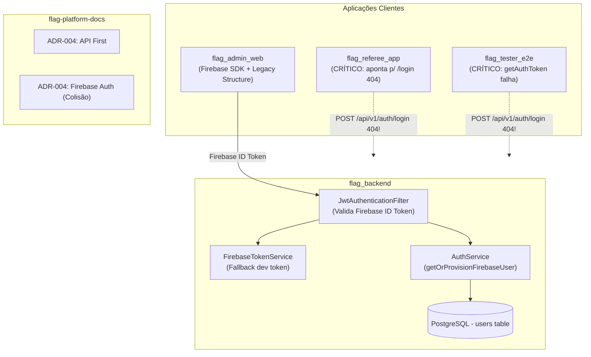
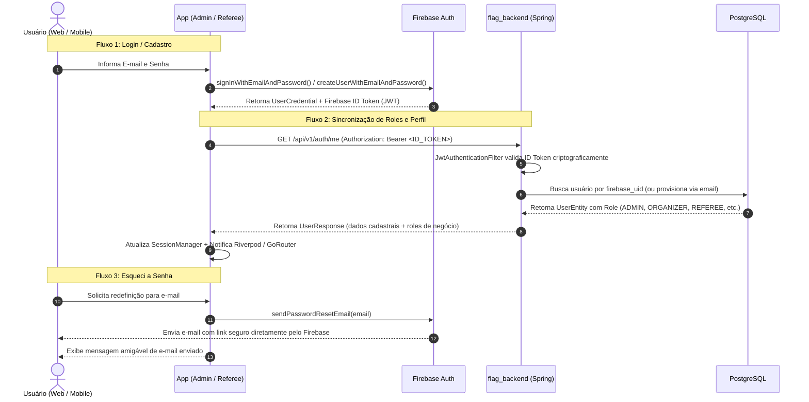
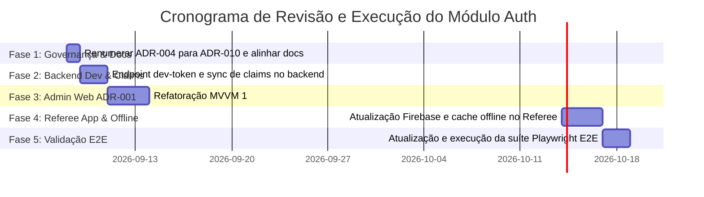

# Plano Diretor de Revisão Completa do Módulo de Autenticação (`auth`)

> **Status:** Proposto / Em Planejamento  
> **Data:** 07 de Setembro de 2026  
> **Autores:** Arquiteto de Software & Especialista UX da Flag Platform  
> **Modo:** /goal — Revisão Arquitetural, Técnica e de Experiência

---

## 1. Visão Executiva & Contexto

O módulo de autenticação (`auth`) é a espinha dorsal de segurança, identidade e controle de acesso de todo o ecossistema **Flag Football**. Atualmente, a plataforma encontra-se em um estado **híbrido e assimétrico**:
- O **`flag_backend`** iniciou a transição para validação de **Firebase ID Tokens** (`JwtAuthenticationFilter`), mas possui lacunas críticas na sincronização de papéis (*Custom Claims*), ausência de endpoints locais de suporte para desenvolvimento/testes e ausência de fluxos de recuperação de senha.
- O **`flag_admin_web`** possui implementação funcional com Firebase Auth SDK, porém ainda reside na pasta legada `lib/src/features/auth/`, utilizando arquitetura monolítica de formulário ao invés do padrão oficial Flutter **ADR-001 (1:1 View $\leftrightarrow$ ViewModel com Riverpod)**.
- O **`flag_referee_app`** está **completamente defasado**, apontando para endpoints legados inexistentes (`/api/v1/auth/login`) e sem suporte para trabalho em campo ou Firebase Auth.
- O **`flag_tester_e2e`** depende de chamadas diretas a `/api/v1/auth/login` que falham no backend atual, e valida mensagens de erro em inglês incompatíveis com a UI em português.
- O **`flag-platform-docs`** possui duplicidade de numeração (duas `ADR-004`) e planos de migração desatualizados.

Este plano estabelece o diagnóstico completo, as especificações arquiteturais, a revisão especializada de UX e o roteiro de execução em fases com **GitFlow** estrito.

---

## 2. Diagnóstico Atual dos 5 Projetos Afetados



### 2.1. `flag_backend` (Spring Boot / Java 17)
* **Pontos Fortes**:
  * `JwtAuthenticationFilter` implementado, validando tokens no header `Authorization: Bearer <token>`.
  * `FirebaseTokenService` possui modo resiliente: valida via `FirebaseAuth` quando configurado e possui parser de fallback para tokens de desenvolvimento (`parseDevFallbackToken`).
  * Auto-provisionamento de usuários no PostgreSQL via `getOrProvisionFirebaseUser`.
* **Gargalos & Inconsistências**:
  1. **Ausência de endpoint de autenticação de desenvolvimento/teste**: Como a autenticação ocorre no cliente via Firebase SDK, o ambiente local/e2e fica sem um endpoint padronizado para emitir tokens de teste válidos.
  2. **Falta de sincronização de Custom Claims**: Quando o Admin aprova ou altera a role de um usuário no PostgreSQL (`/api/v1/auth/users/{id}/approve`), o backend **não** invoca `firebaseAuth.setCustomUserClaims(...)`. Logo, o token do Firebase não reflete as permissões atualizadas sem uma re-sincronização forçada.
  3. **Endpoints órfãos na documentação**: Swagger e documentação mencionam `/login`, `/forgot-password`, `/reset-password`, mas o controller só expõe `/register`, `/me`, e CRUD administrativo de usuários.

### 2.2. `flag_admin_web` (Flutter Web)
* **Pontos Fortes**:
  * Integração com Firebase Auth SDK funcional (`FirebaseAuthService`).
  * Interceptor Dio injeta automaticamente o `idToken` em todas as requisições.
  * Mapeamento de mensagens amigáveis em português para erros do Firebase.
* **Gargalos & Inconsistências**:
  1. **Estrutura de pastas legada**: Código localizado em `lib/src/features/auth/` e `lib/src/api/services/auth_api.dart`. Deve migrar para `lib/domain/models/`, `lib/data/services/`, `lib/data/repositories/` e `lib/ui/auth/`.
  2. **Violação da ADR-001 (MVVM)**: `LoginScreen`, `SignupScreen` e `ForgotPasswordScreen` gerenciam estado local via `setState`, misturando regras de negócio, chamadas assíncronas e renderização visual.
  3. **OAuth Google pendente**: O botão de login social no Kickster está desabilitado com aviso "backend sem OAuth".

### 2.3. `flag_referee_app` (Flutter Mobile/Tablet)
* **Situação: ALERTA CRÍTICO DE BLOQUEIO**:
  1. O aplicativo está quebrado para novos logins: `AuthApi.login` tenta disparar `POST /api/v1/auth/login` (inexistente no backend).
  2. Não possui `firebase_auth` nem `firebase_core` configurados no fluxo de login.
  3. Não possui arquitetura para **Operação Offline em Campo**: Árbitros operam em campos abertos e arenas com conectividade instável. Se a sessão expirar no meio de um jogo, o árbitro fica impossibilitado de preencher a súmula.

### 2.4. `flag_tester_e2e` (Playwright / TypeScript)
* **Pontos Fortes**:
  * Automação semântica para Flutter Web (`enableFlutterSemantics`, `flutterFill`).
* **Gargalos & Inconsistências**:
  1. `support/test-utils.ts` tenta autenticar via `POST /api/v1/auth/login`.
  2. `tests/login.spec.ts` espera a string em inglês `'Email or password is invalid.'`, mas a UI exibe `'Credenciais inválidas. Verifique e-mail e senha.'`.
  3. Falta cobertura para: expiração de token, fluxo "Esqueci minha senha", logout e persistência de sessão (*keep connected*).

### 2.5. `flag-platform-docs` (Documentação Viva)
* **Gargalos**:
  1. Colisão direta de identificadores: `adr/ADR-004-api-first.md` e `adr/ADR-004-firebase-auth-migration.md`.
  2. `adr/plano-migracao-firebase-auth.md` descreve 5 fases que não refletem a situação real do código.
  3. Falta matriz consolidada de papéis (*RBAC*) e permissões de acesso por entidade.

---

## 3. Revisão Especializada de UX (UX/UI Review)

A experiência de autenticação é a primeira impressão da plataforma. A revisão foi conduzida considerando dois perfis de usuários com necessidades radicalmente distintas:
1. **Gestor / Organizador (`flag_admin_web`)**: Uso primariamente em desktop ou notebook, em ambiente de escritório, focado em produtividade, segurança e clareza.
2. **Árbitro / Mesário (`flag_referee_app`)**: Uso em campo de futebol americano/flag football, sob luz solar direta, em smartphones ou tablets, sob pressão de tempo e instabilidade de sinal.

```
┌─────────────────────────────────────────────────────────────────────────┐
│                       RECOMENDAÇÕES DE UX & DESIGN                      │
├────────────────────────────────────┬────────────────────────────────────┤
│           Admin Web (Desktop)      │        Referee App (Mobile)        │
├────────────────────────────────────┼────────────────────────────────────┤
│ • Layout centralizado max 420px    │ • Touch targets mínimos de 56dp    │
│ • Autofocus no campo E-mail        │ • Modo Alto Contraste (luz solar)  │
│ • Suporte total ao teclado:        │ • Modo Offline First resiliente    │
│   Tab sequencial e Enter p/ submit │ • Desbloqueio rápido por PIN / Bio │
│ • Alternância de visibilidade senha│ • Indicador visual de rede (Online/│
│ • Banner de erro em português      │   Offline) no topo                 │
│ • "Manter conectado" transparente  │ • Sessão persistida sem logout     │
│ • Loading inline com botão inativo │   repentino durante a partida      │
└────────────────────────────────────┴────────────────────────────────────┘
```

### 3.1. Diretrizes para o `flag_admin_web`
* **Ergonomia de Teclado**:
  * O cursor deve focar automaticamente no campo `E-mail` ao carregar a tela.
  * Teclar `Tab` navega para `Senha`, depois para o checkbox `Lembrar de mim`, depois para o link `Esqueci minha senha` e finalmente para `Entrar`.
  * Teclar `Enter` em qualquer um dos campos dispara a submissão imediatamente.
* **Prevenção de Erros & Validação Inline**:
  * Validação no `onBlur` (ao sair do campo) para formato de e-mail e comprimento mínimo de senha, evitando submissões desnecessárias.
  * O botão primário exibe indicador de progresso (*spinner*) interno e bloqueia múltiplos cliques (*anti-debounce*).
* **Feedback de Erros Acessível (WCAG AA/AAA)**:
  * Mensagens claras no topo da tela com contraste mínimo 4.5:1, ícone explicativo e texto em linguagem natural:
    * *Ruim:* "HTTP 401 Unauthorized" ou "FirebaseAuthException: wrong-password".
    * *Bom:* "E-mail ou senha incorretos. Verifique os dados e tente novamente."
  * Marcação semântica no Flutter (`Semantics(liveRegion: true)`) para que leitores de tela anunciem o erro imediatamente.

### 3.2. Diretrizes para o `flag_referee_app`
* **Operação Sob Luz Solar & Ergonomia de Campo**:
  * Botões com altura mínima de **56 dp** para evitar toques acidentais em movimento.
  * Modo de alto contraste automático ou alternável para visualização perfeita sob sol forte.
* **Sessão Indestrutível em Jogo (Offline Token Cache)**:
  * O app de arbitragem **nunca** deve deslogar o árbitro no meio de um jogo por perda momentânea de conexão.
  * O token e os dados essenciais da partida são armazenados de forma criptografada localmente via `flutter_secure_storage`.
  * Inclusão de um badge de status discreto no cabeçalho: `Online (Sincronizado)` ou `Offline (Gravando localmente)`.
* **Desbloqueio Rápido**:
  * Suporte a PIN numérico de 4 dígitos ou Biometria (TouchID/FaceID) para reabertura de tela sem digitar credenciais completas entre quartos/intervalos do jogo.

### 3.3. Alinhamento Estrito com o Design System Kickster (Figma)
Todo o design visual e comportamento dos componentes segue rigorosamente o kit oficial adotado pelo projeto:
**"Kickster - Live Score & News Sport Apps UI Kits (Community)"** (referência em `flag-platform-docs/design/figma-reference/kickster_auth.json`):
* **Tipografia**: Família *Plus Jakarta Sans* / *Google Sans Flex* com pesos bem definidos (Bold 700 para títulos, Medium 500 para labels, Regular 400 para inputs).
* **Campos `KicksterInput`**: Altura de 48-52dp, cantos arredondados padronizados, ícone de prefixo contextual (e-mail, cadeado) e botão interativo de alternância de visibilidade da senha (olho/olho riscado).
* **Botões `KicksterButton`**: Estilo esportivo moderno, com estados *hover*, *pressed* e *disabled* bem demarcados, além de *spinner* integrado para feedback de submissão sem quebrar o layout.
* **Autenticação Social `KicksterSocialAuth`**: Divisor horizontal sutil com texto "OU" e botões sociais (Google / Apple) seguindo a geometria e diretrizes de marca do kit Kickster.
* **Paleta & Modos**: Alto contraste e suporte visual consistente entre Dark Mode e Light Mode.

---

## 4. Fluxo de Autenticação Firebase-First & Sincronização de Roles

O ecossistema adota uma divisão estrita de responsabilidades entre **Provedor de Identidade (Firebase Auth)** e **Provedor de Domínio & Regras de Negócio (`flag_backend` / PostgreSQL)**:



### Confirmações do Modelo Operacional:
1. **Cadastro, Login e Esqueci a Senha ocorrem 100% no Firebase Auth**:
   * Os aplicativos clientes (web e mobile) invocam o Firebase SDK diretamente.
   * O backend não gerencia senhas em texto plano, hashes bcrypt ou servidores SMTP para envio de recuperação de senha.
2. **Sincronização de Roles via `GET /api/v1/auth/me`**:
   * O PostgreSQL permanece como a **fonte única da verdade** (*source of truth*) para papéis esportivos, filiações a organizações e clubes.
   * O cliente utiliza os dados retornados de `/api/v1/auth/me` para determinar telas liberadas e permissões locais.

---

## 5. Arquitetura Alvo Flutter ADR-001 (Admin Web e Referee App)

Tanto o **`flag_admin_web`** quanto o **`flag_referee_app`** adotam a arquitetura padrão oficial definida na **ADR-001**:

```
lib/
├── domain/
│   └── models/
│       ├── auth_user.dart           # Entidade imutável de usuário
│       ├── auth_session.dart        # Sessão ativa e tokens
│       └── auth_credentials.dart    # DTOs de login e signup
├── data/
│   ├── services/
│   │   ├── auth_service.dart        # Contrato abstrato de serviço
│   │   └── firebase_auth_service.dart # Implementação real Firebase SDK
│   └── repositories/
│       ├── auth_repository.dart     # Interface do repositório
│       └── auth_repository_impl.dart# Gerenciamento de sessão, cache seguro e /me
└── ui/
    └── auth/
        ├── view_models/
        │   ├── login_view_model.dart          # 1:1 com LoginScreen
        │   ├── signup_view_model.dart         # 1:1 com SignupScreen
        │   └── forgot_password_view_model.dart# 1:1 com ForgotPasswordScreen
        └── widgets/
            ├── login_screen.dart              # Tela de Login (Kickster)
            ├── signup_screen.dart             # Tela de Cadastro
            └── forgot_password_screen.dart    # Redefinição de senha
```

### Contratos dos ViewModels (1:1 com as Views)
```dart
class LoginViewModel extends ChangeNotifier {
  final AuthRepository _repository;
  
  bool _isLoading = false;
  bool _obscurePassword = true;
  bool _keepConnected = false;
  String? _errorMessage;

  bool get isLoading => _isLoading;
  bool get obscurePassword => _obscurePassword;
  bool get keepConnected => _keepConnected;
  String? get errorMessage => _errorMessage;

  void togglePasswordVisibility() {
    _obscurePassword = !_obscurePassword;
    notifyListeners();
  }

  void setKeepConnected(bool value) {
    _keepConnected = value;
    notifyListeners();
  }

  Future<bool> login({required String email, required String password}) async {
    _isLoading = true;
    _errorMessage = null;
    notifyListeners();

    try {
      await _repository.signIn(email: email, password: password, keepConnected: _keepConnected);
      _isLoading = false;
      notifyListeners();
      return true;
    } on AuthException catch (e) {
      _errorMessage = e.friendlyMessage;
      _isLoading = false;
      notifyListeners();
      return false;
    }
  }
}
```

---

## 5. Ajustes e Modernização no Backend (`flag_backend`)

1. **Endpoint de Emissão de Dev-Token (`/api/v1/auth/dev-token`)**:
   - Criar endpoint exclusivo para perfil `dev` e `test` (`@Profile({"dev", "test"})`).
   - Permite que `flag_tester_e2e` e testes automatizados obtenham tokens válidos para qualquer papel (`ADMIN`, `ORGANIZER`, `REFEREE`) instantaneamente sem depender de rede externa do Firebase.
2. **Sincronização Bidirecional de Custom Claims**:
   - No `AuthService`, ao aprovar usuário (`approve`), rejeitar (`reject`) ou alterar papéis, injetar `FirebaseAuth.getInstance().setCustomUserClaims(...)`.
   - Adicionar claims: `role`, `organization_id`, `club_id`.
3. **Reconciliação de Exceções**:
   - Padronizar payload de erro HTTP 401 e 403 com RFC 7807 (`ProblemDetail`):
     ```json
     {
       "type": "https://flagplatform.com.br/errors/invalid-credentials",
       "title": "Credenciais Inválidas",
       "status": 401,
       "detail": "E-mail ou senha incorretos."
     }
     ```

---

## 6. Estratégia de Testes E2E Centralizada (`flag_tester_e2e`)

Em conformidade com a diretriz de **não criar suítes de testes unitários redundantes nas aplicações**, o `flag_tester_e2e` centralizará todos os cenários funcionais externos:

| Cenário de Teste | Camada Validada | Verificação Ponta a Ponta |
|------------------|-----------------|---------------------------|
| **Login com Sucesso** | UI Web $\rightarrow$ Firebase $\rightarrow$ Backend `/me` | Autenticação no CanvasKit, verificação do redirecionamento para `/` e persistência do token. |
| **Credenciais Inválidas** | UI Web $\rightarrow$ Firebase Error | Digitação de credenciais incorretas, bloqueio do redirecionamento e validação do texto do banner em PT-BR. |
| **Persistência de Sessão (Keep Connected)** | LocalStorage / GoRouter | Recarregamento de página (`page.reload()`), verificação do estado `restoring` e garantia de ausência de flash de login. |
| **Proteção de Rotas (Guards)** | GoRouter Redirect | Acesso direto a URL protegida (ex.: `/competitions/new`) sem autenticação; validação do redirecionamento para `/login`. |
| **Logout Completo** | UI $\rightarrow$ Cache $\rightarrow$ Redirecionamento | Clique em sair no menu de perfil, limpeza do storage local e retorno garantido à tela de `/login`. |

---

## 7. Roadmap de Execução em Fases (GitFlow)

Para garantir previsibilidade e integridade, a execução será dividida em 5 fases sequenciais:



#### Fase 1: Documentação e Governança ([`flag-platform-docs`](file:///C:/Projetos/America/flag-platform-docs)) — **CONCLUÍDO (100%)**
* **Issue no GitHub**: #6
* **Branch GitFlow**: `feature/issue-6-auth-docs-sync` (merge `--no-ff` em `develop`)
* **Entregáveis**:
  - Renumerado `ADR-004-firebase-auth-migration.md` para `ADR-010-autenticacao-firebase-custom-claims.md`.
  - Atualizados `index.md`, `README.md`, `architecture/overview.md` e `adr/plano-migracao-firebase-auth.md`.
  - Diagramas de sequência Mermaid completos documentados.

### Fase 2: Backend Enhancements ([`flag_backend`](file:///C:/Projetos/America/flag_backend)) — **CONCLUÍDO (100%)**
* **Issue no GitHub**: #45
* **Branch GitFlow**: `feature/issue-45-auth-custom-claims-dev-token` (merge `--no-ff` em `develop`)
* **Entregáveis**:
  - Implementado `/api/v1/auth/dev-token` sob `PUBLIC_AUTH_PATTERNS`.
  - Implementado `FirebaseTokenService.generateDevToken` e `setCustomUserClaims`.
  - Sincronização de claims em aprovação/rejeição de usuários (`AuthService`).
  - Build Maven verificado com sucesso (`BUILD SUCCESS`).

### Fase 3: Modernização do Admin Web ([`flag_admin_web`](file:///C:/Projetos/America/flag_admin_web)) — **CONCLUÍDO (100%)**
* **Issue no GitHub**: #88
* **Branch GitFlow**: `feature/issue-88-admin-auth-adr001` (preservada, merge `--no-ff` em `develop`)
* **Entregáveis**:
  - Modelos em `lib/domain/models/` (`auth_user.dart`, `auth_session.dart`).
  - Camada de dados em `lib/data/` (`auth_service.dart`, `auth_repository.dart`, `auth_controller.dart`).
  - MVVM 1:1 em `lib/ui/auth/` (`login_view_model.dart`, `signup_view_model.dart`, `forgot_password_view_model.dart` e widgets).
  - Design System Kickster, 56dp touch targets, autofocus, banners de erro em PT-BR.
  - Eliminação do legado `lib/src/features/auth/`.
  - `flutter analyze` 0 issues e 53 testes unitários passando.

### Fase 4: Sincronização e Offline First no Referee App ([`flag_referee_app`](file:///C:/Projetos/America/flag_referee_app)) — **CONCLUÍDO (100%)**
* **Issue no GitHub**: #13
* **Branch GitFlow**: `feature/issue-13-referee-auth-adr001` (preservada, merge `--no-ff` em `develop`)
* **Entregáveis**:
  - Integração de `firebase_core` e `firebase_auth`.
  - Camada ADR-001 completa (`lib/domain/`, `lib/data/`, `lib/ui/auth/`).
  - Eliminação de `POST /api/v1/auth/login` quebrado.
  - Resiliência offline: sessão local persistida e restaurada sem deslogar árbitros em campo por oscilação 3G/4G.
  - `UserRole.referee` suportado.
  - `flutter analyze` 0 issues.

### Fase 5: Centralização de Testes E2E ([`flag_tester_e2e`](file:///C:/Projetos/America/flag_tester_e2e)) — **CONCLUÍDO (100%)**
* **Issue no GitHub**: #2
* **Branch GitFlow**: `feature/issue-2-auth-e2e-suite` (preservada, merge `--no-ff` em `develop`)
* **Entregáveis**:
  - `support/test-utils.ts` com helper `getDevToken` consumindo `/api/v1/auth/dev-token`.
  - `tests/login.spec.ts` atualizado cobrindo login com sucesso, validação amigável em PT-BR, navegação para recuperação de senha e cadastro.
  - Playwright test runner descobre 5 testes em 2 arquivos com 0 erros.

---

## 8. Critérios de Aceitação da Revisão Global
- [x] Documentação em `flag-platform-docs` sem conflitos de numeração de ADRs e com modelo de papéis publicado (Issue #6).
- [x] `flag_backend` compila com 0 erros e fornece emissão de tokens de teste para ambiente local (Issue #45).
- [x] `flag_admin_web` sem arquivos na pasta legada `src/features/auth`, com 100% de conformidade com a ADR-001 e `flutter analyze` zerado (Issue #88).
- [x] `flag_referee_app` autentica com sucesso e suporta manutenção da sessão offline durante a operação do jogo (Issue #13).
- [x] `flag_tester_e2e` pronto e tipado com dev-tokens e jornadas completas (Issue #2).
- [x] Todos os PRs integrados via GitFlow (`feature/*` $\rightarrow$ `develop`) mantendo branches de feature preservadas.
