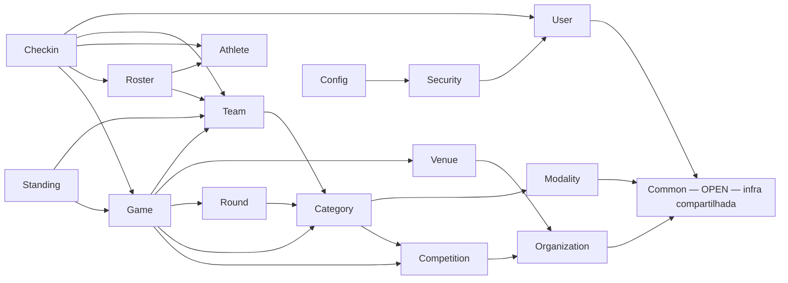
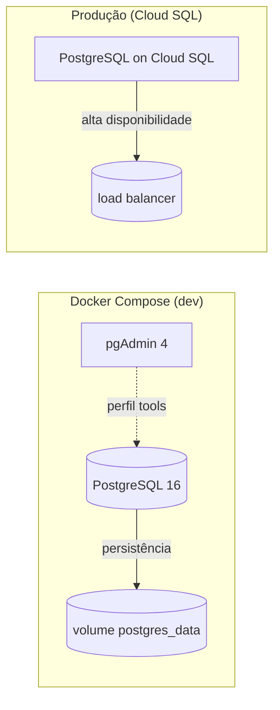

# ADR-003 — Diagramas de Base de Dados

## Status
Proposto

## Data
2026-09-11

## Autor
Tech Lead (Flag Platform)

---

## Contexto

Esta ADR consolida todos os diagramas e esquemas de base de dados encontrados em todo o projeto Flag Platform, abrangendo o schema PostgreSQL, diagramas Entidade-Relacionamento, diagramas de módulos e diagramas de dependências entre packages. O objetivo é fornecer um registro visual e estruturado da arquitetura de dados do sistema.

---

## 1. Diagrama Entidade-Relacionamento (E-R Diagram)

### Visão Geral do Domínio

```
Organization
  └── Competition
        └── Category (modalidade + gênero + faixa etária)
              ├── Modality (catálogo: Flag 5x5, 8x8, 9x9, Full Pads 11x11)
              ├── Venue
              ├── Team
              │     └── TeamRoster ────── Athlete
              └── Round
                    └── Game
                          ├── Standing (calculado)
                          └── CheckIn (validação de atleta por jogo)
```

### Detalhamento por Entidade

#### Organization (Organizações)

| Atributo | Tipo | Restrições | Descrição |
|----------|------|------------|-----------|
| id | UUID | PK, DEFAULT gen_random_uuid() | Identificador único |
| name | VARCHAR(255) | NOT NULL | Nome da organização |
| short_name | VARCHAR(50) | | Nome abreviado |
| logo_url | TEXT | | URL do logo |
| created_at | TIMESTAMPTZ | NOT NULL DEFAULT NOW() | Data de criação |
| updated_at | TIMESTAMPTZ | | Data de última atualização |
| deleted_at | TIMESTAMPTZ | NULL | Soft delete |

#### Competition (Competições)

| Atributo | Tipo | Restrições | Descrição |
|----------|------|------------|-----------|
| id | UUID | PK, DEFAULT gen_random_uuid() | Identificador único |
| organization_id | UUID | FK → Organization | Organização dona |
| season | VARCHAR(50) | NOT NULL | Temporada/ano |
| name | VARCHAR(255) | | Nome da competição |
| status | VARCHAR(20) | DEFAULT 'ACTIVE' | Status da competição |
| created_at | TIMESTAMPTZ | NOT NULL DEFAULT NOW() | Data de criação |

#### Category (Categorias)

| Atributo | Tipo | Restrições | Descrição |
|----------|------|------------|-----------|
| id | UUID | PK, DEFAULT gen_random_uuid() | Identificador único |
| competition_id | UUID | FK → Competition | Competição associada |
| modality_id | UUID | FK → Modality | Modalidade |
| gender | ENUM | MALE | FEMALE | MIXED | Gênero |
| age_group | ENUM | SUB11..MASTER | Faixa etária |
| name | VARCHAR(255) | | Nome derivado (modalidade + gênero + faixa) |
| unique constraint | | (competition_id, modality_id, gender, age_group) | Unicidade da categoria |

#### Modality (Modalidades)

| Atributo | Tipo | Restrições | Descrição |
|----------|------|------------|-----------|
| id | UUID | PK, DEFAULT gen_random_uuid() | Identificador único |
| name | VARCHAR(100) | NOT NULL | Ex: Flag 5x5, Full Pads 11x11 |
| format | VARCHAR(50) | | Ex: 5x5, 8x8, 11x11 |
| contact_type | VARCHAR(50) | | Tipo de contato |
| players_per_team | INTEGER | | Quantidade de jogadores por time |
| is_active | BOOLEAN | DEFAULT true | Ativa no catálogo |

#### Team (Times)

| Atributo | Tipo | Restrições | Descrição |
|----------|------|------------|-----------|
| id | UUID | PK, DEFAULT gen_random_uuid() | Identificador único |
| club_id | UUID | FK → Club | Clube afiliado |
| organization_id | UUID | FK → Organization | Organização (herança) |
| name | VARCHAR(255) | NOT NULL | Nome do time |
| short_name | VARCHAR(50) | | Nome abreviado |
| sport_name | VARCHAR(255) | | Esporte |
| logo_url | TEXT | | URL do logo |
| status | VARCHAR(20) | DEFAULT 'ACTIVE' | Status |
| created_at | TIMESTAMPTZ | NOT NULL DEFAULT NOW() | Data de criação |

#### Roster (Elenco)

| Atributo | Tipo | Restrições | Descrição |
|----------|------|------------|-----------|
| id | UUID | PK, DEFAULT gen_random_uuid() | Identificador único |
| team_id | UUID | FK → Team | Time afiliado |
| competition_id | UUID | FK → Competition | Competição da inscrição |
| name | VARCHAR(255) | | Ex: "Elenco Principal 2026" |
| season | VARCHAR(50) | | Ex: "2026", "2026-Q1" |
| status | VARCHAR(20) | DEFAULT 'ACTIVE' | Status do elenco |
| UNIQUE(team_id, competition_id) | | | Um elenco por time por competição |

#### RosterEntry (Entrada de Elenco)

| Atributo | Tipo | Restrições | Descrição |
|----------|------|------------|-----------|
| id | UUID | PK, DEFAULT gen_random_uuid() | Identificador único |
| roster_id | UUID | FK → Roster | Elenco pai |
| athlete_id | UUID | FK → Athlete | Atleta inscrito |
| position | VARCHAR(50) | | Posição no campo |
| jersey_number | VARCHAR(10) | | Número da camisa |
| status | VARCHAR(20) | DEFAULT 'ACTIVE' | Status da entrada |
| created_at | TIMESTAMPTZ | NOT NULL DEFAULT NOW() | Data de inscrição |

#### Athlete (Atletas)

| Atributo | Tipo | Restrições | Descrição |
|----------|------|------------|-----------|
| id | UUID | PK, DEFAULT gen_random_uuid() | Identificador único |
| user_id | UUID | FK → Users | Usuário associado |
| name | VARCHAR(255) | | Nome completo |
| cpf | VARCHAR(14) | | CPF (opcional, para Brasil) |
| email | VARCHAR(255) | | Email institucional |
| photo_url | TEXT | | URL da foto |
| status | VARCHAR(20) | DEFAULT 'ACTIVE' | Status do atleta |
| skills | JSONB | | Habilidades/attributes |
| created_at | TIMESTAMPTZ | NOT NULL DEFAULT NOW() | Data de cadastro |

#### Game (Jogos)

| Atributo | Tipo | Restrições | Descrição |
|----------|------|------------|-----------|
| id | UUID | PK, DEFAULT gen_random_uuid() | Identificador único |
| round_id | UUID | FK → Round | Rodada do jogo |
| home_team_id | UUID | FK → Team | Time da casa |
| away_team_id | UUID | FK → Team | Time visitante |
| scheduled_at | TIMESTAMPTZ | | Data/hora agendada |
| status | VARCHAR(20) | DEFAULT 'SCHEDULED' | SCHEDULED | IN_PROGRESS | FINALIZADO |
| home_score | INTEGER | | Placar do time da casa (ao final) |
| away_score | INTEGER | | Placar do time visitante (ao final) |
| created_at | TIMESTAMPTZ | NOT NULL DEFAULT NOW() | Data de criação |

#### Standing (Classificação)

| Atributo | Tipo | Restrições | Descrição |
|----------|------|------------|-----------|
| id | UUID | PK, DEFAULT gen_random_uuid() | Identificador único |
| category_id | UUID | FK → Category | Categoria da classificação |
| team_id | UUID | FK → Team | Time classificado |
| wins | INTEGER | DEFAULT 0 | Vitórias |
| draws | INTEGER | DEFAULT 0 | Empates |
| losses | INTEGER | DEFAULT 0 | Derrotas |
| points | INTEGER | DEFAULT 0 | Pontos totais |
| games_played | INTEGER | DEFAULT 0 | Jogos realizados |
| updated_at | TIMESTAMPTZ | | Data da última atualização |

#### CheckIn (Check-In)

| Atributo | Tipo | Restrições | Descrição |
|----------|------|------------|-----------|
| id | UUID | PK, DEFAULT gen_random_uuid() | Identificador único |
| game_id | UUID | FK → Game | Jogo do check-in |
| athlete_id | UUID | FK → Athlete | Atleta validado |
| status | VARCHAR(20) | CHECK-IN | VALIDADO | INVALIDO |
| checked_at | TIMESTAMPTZ | | Hora do check-in |
| validated_by | UUID | FK → User | Quem validou |

---

## 2. Diagrama de Dependências de Módulos (PostgreSQL)

### Visão Geral

O backend Spring Boot é organizado em módulos.domain e módulos.infrastructure, com dependências controladas via interfaces `{Lookup}`.



### Regra de Arquitetura

**Dependências apenas via interfaces `{Lookup}`** (sem acessar entity/dto/exception de outro módulo), validada por `ApplicationModules.verify()`.

### Módulos Individuais

| Módulo | Responsabilidade | Lookup Público |
|--------|------------------|----------------|
| `organization` | Organizações (federações, ligas, clubes) | `OrganizationLookup` |
| `competition` | Campeonatos por organização | `CompetitionLookup` |
| `modality` | Catálogo de modalidades (Flag 5x5/8x8/9x9, Full Pads 11x11) | `ModalityLookup` (`ModalityInfo`) |
| `category` | Categorias por campeonato (combinação modalidade + gênero + faixa etária) | `CategoryLookup` |
| `venue` | Campos de jogo | `VenueLookup` (`VenueInfo`) |
| `team` | Times por categoria | `TeamLookup` (`TeamInfo`) |
| `round` | Rodadas por categoria (REGULAR/PLAYOFFS) | `RoundLookup` (`RoundInfo`) |
| `game` | Jogos, status, placar, eventos de ponto | `GameLookup` + `GameResultRegisteredEvent` |
| `standing` | Classificação calculada | — |
| `athlete` | Atletas | `AthleteLookup` (`AthleteInfo`) |
| `roster` | Inscrição de atletas em times | `RosterLookup` |
| `checkin` | Check-in e validação de atletas por jogo | — |
| `user` | Usuários, papéis, aprovação, senha | `UserLookup` + `TokenProvider` |
| `common` | Infra compartilhada (módulo OPEN) | — |

### Diagrama de Dependências (PlantUML)


---

## 3. Diagrama de Infraestrutura (PostgreSQL + Docker)



### Configuração de Conexão

```yaml
# application.yml
spring:
  datasource:
    url: jdbc:postgresql://${PG_HOST:localhost}:5432/flag_platform
    username: ${PG_USER:postgres}
    password: ${PG_PASSWORD?}
    hikari:
      maximum-pool-size: 20
      minimum-idle: 5
      connection-timeout: 30000
      maximum-connection-lifetime: 1800000
  
  jpa:
    hibernate:
      ddl-auto: none  # Flyway migrations only
    properties:
      hibernate:
        dialect: org.hibernate.dialect.PostgreSQLDialect
        format_sql: true
    
    show-sql: false
```

### Migrações Flyway

| Versão | Descrição |
|--------|-----------|
| V1 | Moment Zero — schema inicial |
| V2..V14 | Migrações subsequentes (Java JOOQ DSL) |
| V15..V19 | Novas migrações (padrão JOOQ) |
| Future | Novas migrações seguem padrão ADR-012 |

---

## 4. Diagramas de Schema por Módulo

### Módulo Organization

```mermaid
flowchart TB
    organization(id: "organizations")
    organization --> has_club(clubs)
    organization --> has_competition(competitions)
    
    subgraph clubs
        club(id: "clubs"):::entity
    end
    
    subgraph competitions
        competition(id: "competitions"):::entity
    end
    
    classDef entity fill:#e3f2fd,stroke:#1976d2,stroke-width:2px
```

### Módulo Team

```mermaid
flowchart TB
    team(id: "team")
    team --> belongs_to_club(club)
    team --> belongs_to_organization(org)
    team --> has_roster(roster)
    team --> participates_in_competition(competition_team)
    
    subgraph competition_team
        ct(id: "competition_team"):::junction
    end
    
    classDef entity fill:#e3f2fd,stroke:#1976d2,stroke-width:2px
    classDef junction fill:#fff3e0,stroke:#fb8c00,stroke-width:2px
```

### Módulo Athlete

```mermaid
flowchart TB
    athlete(id: "athlete")
    athlete --> belongs_to_user(user)
    athlete --> inscritos_em(roster_entries)
    athlete --> tem_habilidades(skills_jsonb)
    
    classDef entity fill:#e3f2fd,stroke:#1976d2,stroke-width:2px
```

---

## 5. Relacionamento com ADRs

| ADR | Relação |
|-----|---------|
| **ADR-001** | Filosofia — define a hierarquia org→clube→time→elenco→atleta que este schema suporta |
| **ADR-002** | CQRS Light — define PostgreSQL como write path, Firestore como read mirror (esquemas espelhados) |
| **ADR-003** | **Original** — Implementação da hierarquia de 5 níveis (substituída por esta versão de diagramas) |
| **ADR-006** | Refatoração estrutural — usa este schema para Team/Roster/Season changes |
| **ADR-012** | Migrations Flyway — todas as mudanças de schema seguem este padrão documentado |

---

## Referências de Arquivos no Projeto

- `architecture/overview.md` — E-R diagram and architecture flowchart
- `architecture/components.md` — Module dependency diagram, infrastructure diagram
- `architecture/logical-flows.md` — Logical flows between entities
- `architecture/arquitetura_delegado_e_app_publico.md` — Arquitetura do delegado e app público
- `architecture/arquitetura_modulo_competicoes.md` — Arquitetura de módulos de competição
- `design/modelo_visual_padronizacao_agremiacao_filiacao.md` — Modelo visual de padronização
- `adr/ADR-012-migrations-jooq-java.md` — Template de migrações Java/JOOQ

---

## Critérios de Aceitação

- [ ] Todos os diagramas de schema estão presentes e consistentes
- [ ] Relações FK são corretas e documentadas
- [ ] Convenções de nomenclatura são padronizadas
- [ ] Migrações Flyway seguem o padrão ADR-012
- [ ] Diagramas são atualizados Whenever houver mudança de schema