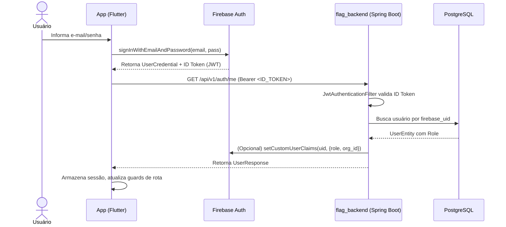
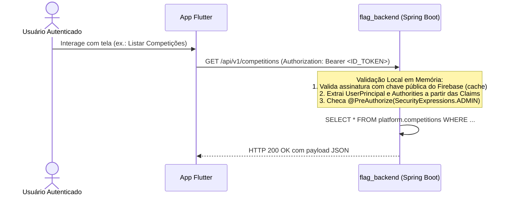
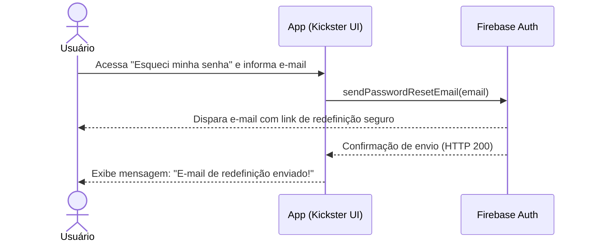
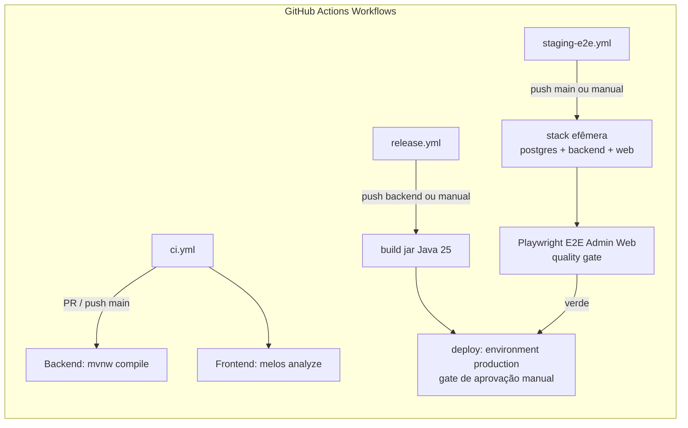
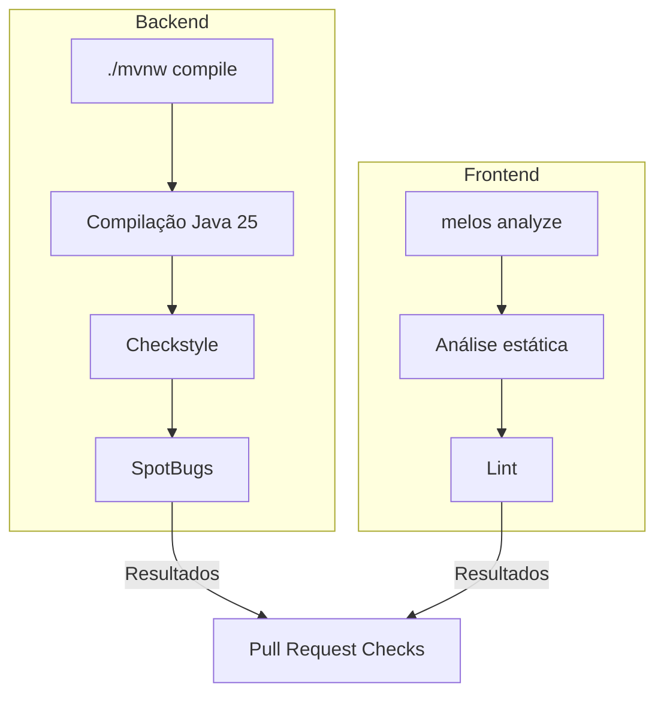
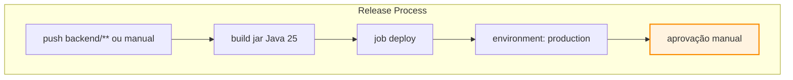
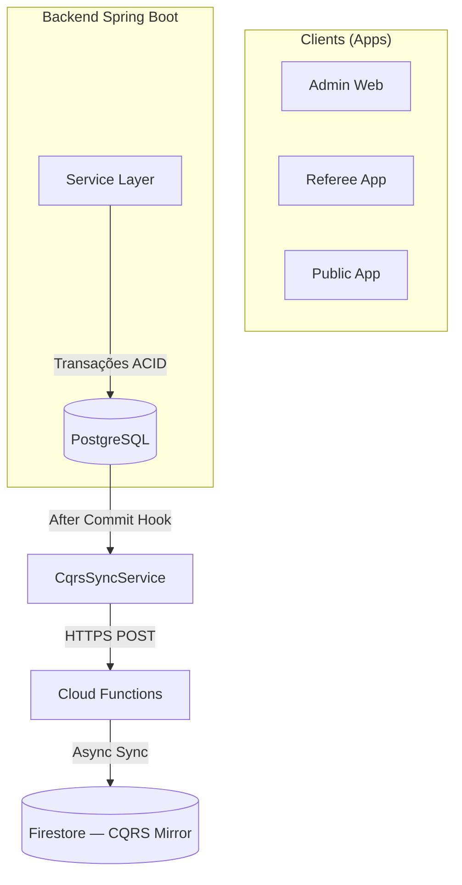
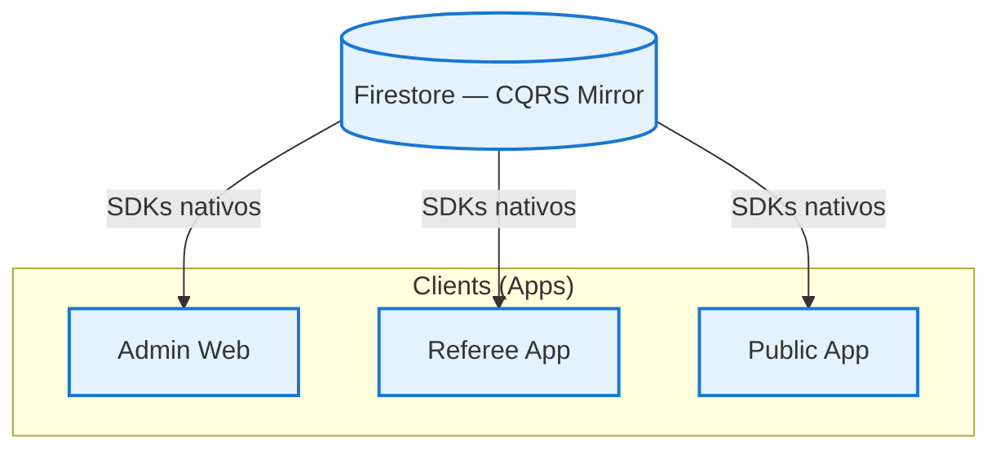

# ADR-004 — Diagramas de Fluxo do Projeto

## Status
Proposto

## Data
2026-09-11

## Autor
Tech Lead (Flag Platform)

---

## Contexto

Esta ADR consolida todos os diagramas de fluxo encontrados em todo o projeto Flag Platform, abrangendo fluxos de negócio, fluxos de CI/CD, fluxos de autenticação e fluxos de usuário através do sistema. O objetivo é fornecer um registro visual do "como as coisas funcionam" em todo o ecossistema Flag Platform.

---

## 1. Fluxo de Domínio — Organizador a Público

### Visão Geral de Ponta a Ponta

```mermaid
flowchart TB
    subgraph "Administrador (Admin Web)"
        A1[Cadastro de Organização] --> A2[Criação de Campeonato]
        A2 --> A3[Definição de Categorias]
        A3 --> A4[Cadastro de Campos e Times]
        A4 --> A5[Agendamento de Rodadas]
    end
    
    subgraph "Backend (API REST /api/v1)"
        B1[A1] -->|POST /organizations| B2[Persist Organization]
        B2 --> B3[A2] -->|POST /competitions| B4[Persist Competition]
        B4 --> B5[A3] -->|POST /categories| B6[Persist Categories]
        B6 --> B7[A4] -->|POST /teams| B8[Persist Teams]
        B8 --> B9[A5] -->|POST /rounds| B10[Persist Rounds]
        B10 --> B11[Schedule Games]
    end
    
    subgraph "Público (Public App)"
        C1[Visualização de Calendário] --> C2[Acompanhamento de Jogos]
        C2 --> C3[Classificação em Tempo Real]
        C3 --> C4[Detalhes do Jogo]
    end
    
    subgraph "Árbitro (Referee App)"
        D1[Check-In de Atletas] --> D2[Operação de Jogo]
        D2 --> D3[Atualização de Placar]
        D3 --> D4[Finalização e Recalcificação]
    end
    
    B11 -->|Dados para| C1 & D1
    C4 & D4 -->|Atualizações via| Polling a cada 10s
```

### Passo a Passo Detalhado

1. **Organizador cadastra organização** → `POST /api/v1/organizations` → organização persistida em PostgreSQL
2. **Organizador publica campeonato** → `POST /api/v1/competitions` → competição criada com season obrigatório
3. **Organizador define categorias** → combinações de modalidade + gênero + faixa etária → `POST /api/v1/categories`
4. **Organizador cadastra times** → times associados a clubes → `POST /api/v1/organizations/{orgId}/teams`
5. **Organizador agenda jogos** → rodadas e jogos → `POST /api/v1/rounds` + `POST /api/v1/games`
6. **Público acompanha sem login** → calendário, resultados, classificação → polling a cada 10s da API
7. **Árbitro faz check-in** → validação de atletas → `POST /api/v1/checkins`
8. **Árbitro opera jogo** → atualização de placar ponto a ponto → `PATCH /api/v1/games/{id}`
9. **Ao finalizar** → recálculo automático de classificação → `PUT /api/v1/competitions/{id}`

---

## 2. Fluxo de Autenticação (Firebase-First)

### Fluxo de Login / Cadastro



### Fluxo Stateless de Requisições de Negócio



### Fluxo de Recuperação de Senha



---

## 3. Fluxo de CI/CD — GitHub Actions

### Visão Geral



### Detalhes por Workflow

#### ci.yml (Pull Request / Push main)



#### staging-e2e.yml (Staging Efêmero + E2E)

```mermaid
flowchart TB
    substack "Stack Efêmera"
        STG[stack efêmera: postgres + backend perfil staging + build web Admin Web]
        PW[Playwright E2E: login + criação de organização]
        
        STG --> PW
        PW -->|Resultado (verde/vermelho)| STG
    end
    
    STG -->|Promoção| DEP[deploy: environment production]
```

#### release.yml (Release Produção)



---

## 4. Fluxo de Dados — Write Path vs Read Path

### Write Path (PostgreSQL — Source of Truth)



### Read Path (Firestore — Espelho de Leitura)



### Princípios

| Direção | Responsabilidade | Tecnologia |
|---------|------------------|------------|
| **Write** | Transações, integridade, validações | PostgreSQL (ACID) |
| **Read** | Dashboards, leaderboards, real-time scores | Firestore (escalável) |
| **Sync** | Event-driven via Cloud Functions | PostgreSQL → Firestore |

---

## 5. Fluxo de Migração de Dados

### Cenário: Migração de Schema de Team/Roster/Season

```mermaid
flowchart TB
    subgraph "Antes (Legado)"
        L1[Team como tabela pivô] --> L2[RosterEntry referencia team_id]
        L2 --> L3[Season como campo opcional]
    end
    
    subgraph "Depois (Nova Estrutura)"
        N1[Team tabela nova] --> N2[competition_team nova]
        N2 --> N3[Roster tabela nova]
        N3 --> N4[RosterEntry referencia roster_id]
        N4 --> N5[Competition tem season obrigatório]
    end
    
    subgraph "Passos da Migração"
        M1[Criar tabela team (nova)] --> M2[Criar tabela competition_team]
        M2 --> M3[Criar tabela roster]
        M3 --> M4[Atualizar roster_entry (roster_id)]
        M4 --> M5[Adicionar season a competition]
    end
    
    L1 -->|Truncate + Dados migrados| N1
```

### Etapas Práticas

1. **Fase 1 — Backend**: Criar tabelas novas, atualizar roster_entry, adicionar season a competition
2. **Fase 2 — Admin Web**: Atualizar domain models, API services, telas de gestão
3. **Fase 3 — Apps**: Atualizar consumo de API, navegação nos apps Público e Referee

---

## 6. Relacionamento com ADRs

| ADR | Relação |
|-----|---------|
| **ADR-001** | Filosofia — define a hierarquia que estes fluxos suportam |
| **ADR-002** | CQRS Light — define write/read path que estes diagramas ilustram |
| **ADR-003** | **Original** — Implementação da hierarquia (substituída por diagramas de BD) |
| **ADR-004** | **Original** — API First (substituída por diagramas de fluxo do projeto) |
| **ADR-005** | Staging E2E — fluxo de quality gate que integra neste workflow |
| **ADR-006** | Refatoração — usa estes fluxos para Team/Roster/Season changes |
| **ADR-010** | Auth Firebase — fluxo de auth que está integrado a todos os diagramas |
| **ADR-013** | Gitflow — fluxo de branches que acompanha estas mudanças |
| **ADR-014** | Atualização de diretivas — como estes diagramas são mantidos atualizados |

---

## Referências de Arquivos no Projeto

- `architecture/overview.md` — Fluxo organizador a público, write/read path
- `architecture/components.md` — CI/CD workflows (ci.yml, staging-e2e.yml, release.yml)
- `architecture/logical-flows.md` — Fluxos lógicos da solução
- `architecture/arquitetura_delegado_e_app_publico.md` — Fluxo do delegado e app público
- `architecture/arquitetura_modulo_competicoes.md` — Arquitetura de módulos
- `design/modelo_visual_padronizacao_agremiacao_filiacao.md` — Modelo visual
- `research/flagstats-mapeamento.md` — Mapeamento de métricas
- `.github/workflows/ci.yml` — Workflow de CI
- `.github/workflows/staging-e2e.yml` — Workflow de staging E2E
- `.github/workflows/release.yml` — Workflow de release

---

## Critérios de Aceitação

- [ ] Todos os fluxos de negócio estão documentados e consistentes
- [ ] Fluxos de CI/CD são precisos e refletem a configuração atual
- [ ] Fluxos de autenticação seguem o padrão Firebase-First (ADR-010)
- [ ] Write path e read path estão corretamente demarcados (ADR-002)
- [ ] Diagramas são atualizados whenever houver mudança significativa de fluxo
- [ ] Cross-referências com ADRs estão corretos