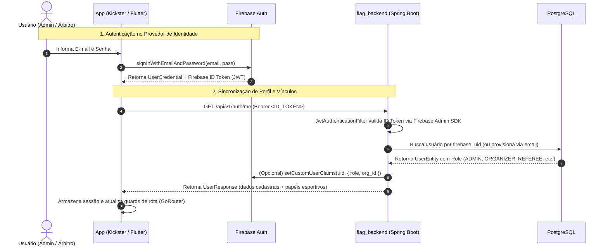
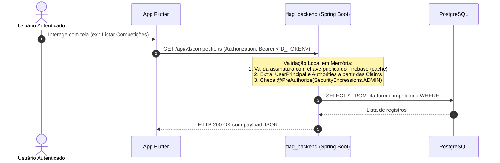
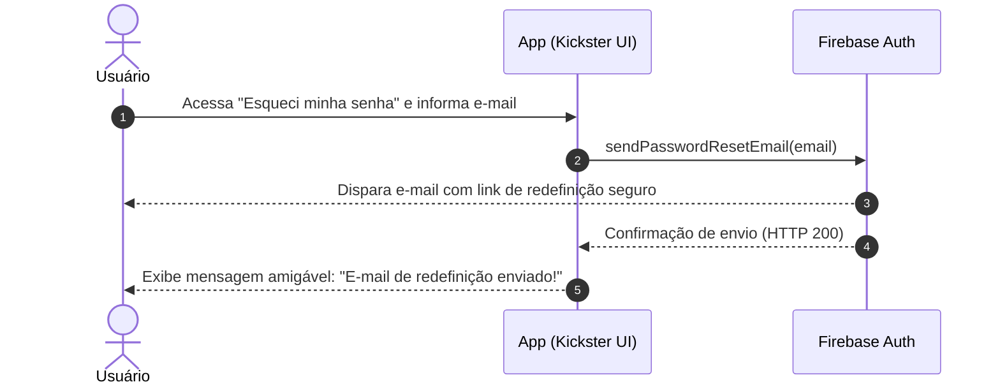

# ADR-010 — Autenticação Firebase-First com Custom Claims e Validação Stateless

## Status

**Aceito** — 2026-09-07 (Substitui e consolida a proposta anterior de migração — hoje preservada como [ADR-020](ADR-020-firebase-auth-migration.md) — que colidia com a ADR-004 de API First da linhagem `main`)

---

## 1. Contexto

A Flag Platform é composta por múltiplos clientes:
- **`flag_admin_web`**: Painel administrativo web para gestores de federações, ligas e agremiações.
- **`flag_referee_app`**: Aplicativo móvel/tablet para árbitros e mesários operando à beira do campo.
- **`flag_public_app`**: Aplicativo móvel para torcedores, atletas e comunidade esportiva.

Anteriormente, a plataforma contava com autenticação fragmentada baseada em JWT custom (HS256) emitido diretamente pelo Spring Boot (`flag_backend`). Esse modelo gerava graves problemas:
1. O backend acumulava responsabilidades que não são do seu domínio central (armazenamento e hash de senhas, validação de formato, infraestrutura de e-mails para recuperação de senha).
2. Ausência de suporte nativo a OAuth (Google, Apple) e MFA.
3. Risco de indisponibilidade ou latência caso cada requisição de API exigisse consultas síncronas de autorização entre microsserviços.
4. Chamadas desatualizadas nos clientes (o `flag_referee_app` apontava para endpoints legados como `/api/v1/auth/login`).

Além disso, na documentação histórica houve uma colisão de numeração entre a **ADR-004 — API First** e uma proposta anterior de migração. Esta ADR-010 resolve a colisão e oficializa a decisão arquitetural definitiva. A proposta histórica foi renumerada e preservada como [ADR-020 — Migração de Autenticação para Firebase Auth + Custom Claims](ADR-020-firebase-auth-migration.md).

---

## 2. Decisão Arquitetural

Adotamos o padrão **Firebase-First com Custom Claims e Validação Stateless no Backend**:

1. **Firebase Auth como Provedor de Identidade (IdP)**:
   - Todos os aplicativos clientes (Web e Mobile) realizam cadastro (`createUserWithEmailAndPassword`), login (`signInWithEmailAndPassword`), redefinição de senha (`sendPasswordResetEmail`) e autenticação social diretamente pelo Firebase Auth SDK.
   - O backend não armazena senhas em texto plano, nem hashes bcrypt, e não possui servidor SMTP para recuperação de senhas.

2. **PostgreSQL (`flag_backend`) como Fonte Única da Verdade para Regras e Papéis**:
   - A tabela `users` no PostgreSQL mantém a autoridade sobre papéis esportivos (`role`), status de aprovação (`status`) e afiliações organizacionais (`organization_id`, `club_id`).

3. **Sincronização Bidirecional via Custom Claims**:
   - O backend utiliza o **Firebase Admin SDK** para gravar as roles e IDs de afiliação diretamente nos **Custom Claims** do Firebase:
     ```json
     {
       "sub": "firebase-uid-12345",
       "role": "ADMIN_LIGA",
       "organization_id": "9b1deb4d-3b7d-4bad-9bdd-2b0d7b3dcb6d",
       "club_id": null,
       "email": "gestor@flagplatform.com.br"
     }
     ```

4. **Validação 100% Stateless nas Requisições de Negócio**:
   - Quando o cliente realiza chamadas às APIs de negócio (ex.: `/api/v1/competitions`, `/api/v1/games`), o `flag_backend` valida a assinatura criptográfica do ID Token utilizando as chaves públicas do Google (em cache local).
   - O backend extrai a role diretamente das Claims do token em memória, **sem realizar nenhuma chamada de rede externa ou consulta repetitiva de autorização**, garantindo latência mínima e alta performance.

5. **Extensão Obrigatória da ADR-001 para Todos os Clientes**:
   - Tanto o **`flag_admin_web`** quanto o **`flag_referee_app`** devem adotar a arquitetura oficial Flutter (ADR-001):
     - Camada Domain: entidades e regras de validação.
     - Camada Data: `AuthService` e `AuthRepository`.
     - Camada Presentation: ViewModels dedicados (1:1 com as Views via Riverpod/ChangeNotifier) e Widgets do design kit Kickster.
   - O `flag_referee_app` implementa **modo offline resiliente** com `flutter_secure_storage`, garantindo que o árbitro continue logado durante a partida mesmo sob oscilação ou ausência de sinal 4G.

6. **Design System Kickster**:
   - A experiência do usuário de todos os formulários e telas de autenticação segue o design kit oficial **"Kickster - Live Score & News Sport Apps UI Kits (Community)"** (`design/figma-reference/kickster_auth.json`).

---

## 3. Diagramas de Sequência

### 3.1. Fluxo de Login / Cadastro e Sincronização de Roles



---

### 3.2. Fluxo Stateless de Requisições de Negócio (Zero Latência)



---

### 3.3. Fluxo de Recuperação de Senha (Esqueci a Senha)



---

## 4. Matriz de Papéis e Permissões (RBAC)

| Papel (*Role*) | Escopo de Acesso | Custom Claim (`role`) | Descrição e Permissões |
|---|---|---|---|
| **`ADMIN`** / **`ADMIN_LIGA`** | Global da Plataforma / Liga | `"ADMIN"` / `"ADMIN_LIGA"` | Acesso irrestrito a configurações, criação de usuários, aprovação de contas e gestão de torneios. |
| **`ORGANIZER`** | Organização Federativa | `"ORGANIZER"` (`organization_id`) | Gestão de campeonatos, agremiações filiadas, tabelas e locais de jogo de sua entidade. |
| **`MANAGER`** | Agremiação / Clube | `"MANAGER"` (`club_id`) | Gestão de elencos (*rosters*), inscrição de times e acompanhamento de atletas. |
| **`REFEREE`** | Súmula e Arbitragem | `"REFEREE"` | Acesso ao `flag_referee_app` para check-in de atletas, controle de cronômetro e envio de súmulas. |
| **`COACH`** | Comissão Técnica | `"COACH"` (`club_id`) | Visualização tática e submissão de escalações para partidas. |
| **`ATHLETE`** | Individual do Atleta | `"ATHLETE"` | Perfil pessoal no `flag_public_app`, visualização de estatísticas e consentimentos. |

---

## 5. Consequências

### Positivas
- **Segurança de Nível Enterprise**: Senhas e identidades delegadas à infraestrutura segura do Google Firebase.
- **Zero Overhead no Backend**: Validação puramente em memória das requisições com chave pública, eliminando chamadas de rede entre microsserviços para autorização.
- **Arquitetura Unificada**: Frontend Web e Mobile operam sob os mesmos contratos e sob o padrão oficial ADR-001.
- **Operação de Campo Confiável**: Árbitros operam offline no `flag_referee_app` sem interrupções por timeout de sessão.

### Negativas / Mitigações
- **Limite de 1000 bytes em Custom Claims**: Mitigado pelo uso de claims compactas (`role`, `organization_id`, `club_id`), deixando detalhes de perfil armazenados no PostgreSQL.
- **Latência de propagação de novas claims**: Mitigado pela emissão forçada de token atualizado (`getIdToken(true)`) quando o usuário tem seu papel alterado.

---

## 6. Ajustes de Implementação — Firebase Auth exclusivo + PENDING read-only

> **Rastreabilidade:** conteúdo absorvido de **ADR-008 — Ajustes de Autenticação** (linhagem `main`,
> originalmente implementado em `flag_backend@4482c5e` e `flag_admin_web@96b2c0d`). O arquivo standalone
> `adr/ADR-008-ajustes-autenticacao.md` foi removido na reconciliação de linhagens. A decisão original de
> migração está preservada como [ADR-020](ADR-020-firebase-auth-migration.md).

### 6.1. Fluxo de autenticação

| Operação | Onde | Como |
|---|---|---|
| Signup | Flutter | `FirebaseAuth.signUpWithEmailPassword()` → `signOut()` → `POST /register {name,email}` |
| Login | Flutter | `FirebaseAuth.signInWithEmailPassword()` → `getIdToken(true)` → `GET /me` (Bearer ID Token) |
| Forgot password | Flutter | `FirebaseAuth.sendPasswordResetEmail()` direto (sem backend) |

O backend **não armazena nem valida senha**. O único ponto autenticado no fluxo é `GET /me`.

### 6.2. Endpoints

- **Mantidos:** `POST /register` (público, sem senha), `GET /me`, `POST /users`, `GET /users`, `GET /users/pending`, `POST /users/{id}/approve|reject`.
- **Removidos:** `POST /login`, `POST /forgot-password`, `POST /reset-password`.

### 6.3. Modelo de dados

- `users.password_hash` removido (migration `V4__RemovePasswordHashAndResetTokens`).
- `password_reset_tokens` removido (mesma migration).
- `RegisterRequest` / `CreateUserRequest` sem campo `password`.
- `UserMapper`, `UserDetailsServiceImpl`, `StagingDataSeeder` sem referência a senha.

### 6.4. Verificação de token

- `FirebaseJwtVerifier` (verificação manual com `java.net.http` + `jjwt`) **removido**.
- `FirebaseTokenService` volta a usar `FirebaseAuth.verifyIdToken()` nativo do Firebase Admin SDK.
  O bug de `Not in GZIP format` (`google-http-client 1.45.3 + JDK 25`) é contornado via exclusão de
  `google-http-client-apache-v2` no `pom.xml` e `System.setProperty("java.net.preferIPv4Stack")` /
  `https.protocols` em `FirebaseConfig`.

### 6.5. PENDING read-only

- `JwtAuthenticationFilter` autentica **qualquer** status (antes bloqueava `PENDING`) e vincula
  `firebase_uid` via `AuthService.getOrProvisionFirebaseUser()`.
- `UserPrincipal` sempre `isEnabled=true`; authorities incluem `STATUS_ACTIVE` ou `STATUS_PENDING` + `ROLE_*`.
- `SecurityExpressions` (`ADMIN`, `ADMIN_OR_ORGANIZER`, `ADMIN_OR_MESA`, `CLUB_MANAGER`) exigem
  `hasAuthority('STATUS_ACTIVE')`. `PENDING` passa em `isAuthenticated()` e leitura (`GET`), mas falha em
  qualquer escrita (`POST/PUT/PATCH/DELETE`) com 403.

### 6.6. Frontend (`flag_admin_web`)

- `AuthApi`: removidos `loginWithFirebaseToken()`, `forgotPassword()`, `resetPassword()`; `register()` e
  `createUser()` sem `password`.
- `LoginResponse` e `reset_password_screen.dart` (rota `/reset-password`) removidos;
  `forgot_password_screen.dart` mantido (usa Firebase SDK direto).
- `UserFormScreen` sem campo de senha; `app_router` sem import/rota de reset.

### 6.7. Consequências

- Auth 100% Firebase SDK; o backend é apenas lookup validado, sem hash de senha nem reset tokens no banco.
- `PENDING` passa a ter UX melhor (vê dados, sem bloqueio total no login) mantendo escrita bloqueada.
- Superfície de ataque reduzida; dependência volta ao Firebase Admin SDK oficial.

### 6.8. Arquivos-chave

- `flag_backend`: `AuthController`, `AuthService`, `RegisterRequest`, `UserEntity`, `SecurityConfig`,
  `JwtAuthenticationFilter`, `UserPrincipal`, `SecurityExpressions`, `FirebaseTokenService`,
  `FirebaseConfig`, `V4__RemovePasswordHashAndResetTokens`.
- `flag_admin_web`: `auth_api.dart`, `signup_screen.dart`, `auth_controller.dart`, `user_form_screen.dart`,
  `app_router.dart`.

> **Nota:** `architecture/ajustes-autenticacao.md` descreve o estado anterior a estes ajustes e está
> marcado como histórico/superado.

## 7. Documentos Relacionados
- [ADR-001 — Nova Filosofia de Arquitetura de Aplicações](ADR-001-nova-filosofia-arquitetura.md)
- [ADR-019 — Modular Monolith com Spring Boot](ADR-019-modular-monolith.md)
- [ADR-004 — Diagramas de Fluxo do Projeto](ADR-004-diagramas-projeto.md)
- [Plano de Migração de Autenticação](../_planning/plano-migracao-firebase-auth.md)
- [Governança de Agentes e Skills](../architecture/governanca-agentes-skills.md)
