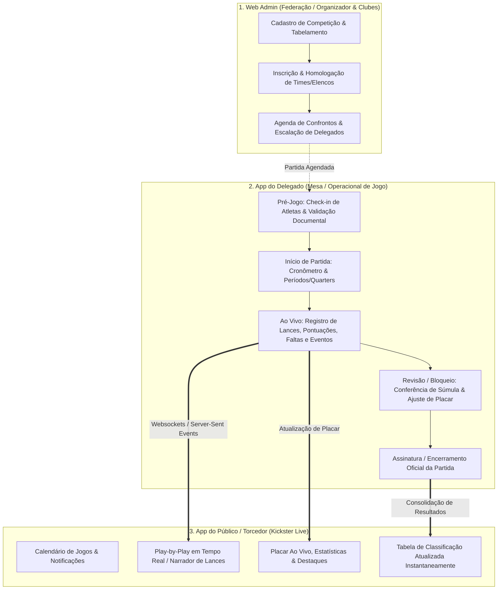
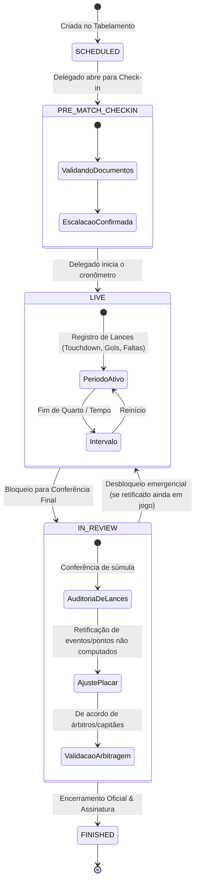
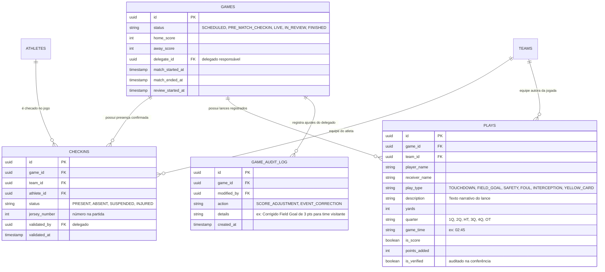

# Arquitetura do Ecossistema de Partidas: Mesa do Delegado & App Público

Este documento expande o módulo de competições integrando os dois aplicativos operacionais:
1. **App do Delegado (Mesa / Súmula Eletrônica & Gestão de Partida)**
2. **App do Público / Torcedor (Live Scores, Confrontos, Classificação & Estatísticas)**

---

## 1. Visão Geral dos 3 Componentes do Ecossistema

---

## 2. Ciclo de Vida da Partida (Máquina de Estados)

A partida transita por estados bem definidos para garantir integridade esportiva e auditoria:

### Detalhamento dos Estados:
1. **`SCHEDULED`**: Jogo agendado com data, hora, local e times.
2. **`PRE_MATCH_CHECKIN`**: Aberto pelo delegado ~1h antes do jogo. Lista os atletas do Roster oficial inscrito para validação presencial (foto, RG/documento, número da camisa).
3. **`LIVE`**: Partida em andamento. Eventos transmitidos em broadcast em tempo real para os torcedores.
4. **`IN_REVIEW` (Bloqueio para Conferência)**: O cronômetro parou. O sistema trava a edição pública e coloca o jogo em modo "Em Revisão/Aguardando Súmula Oficial". O delegado confere todas as faltas, pontos, cartões e ajusta qualquer inconsistência.
5. **`FINISHED`**: Partida encerrada em definitivo. Dispara o recálculo imediato da tabela de classificação (`platform.standings`).

---

## 3. Modelo de Dados para Operação & Eventos

O banco de dados já possui fundação pronta (`platform.games`, `platform.checkins`, `platform.plays`, `platform.score_events`):

---

## 4. Jornada do Delegado (App da Partida)

| Etapa | Ação na Tela | Impacto no Sistema |
| :--- | :--- | :--- |
| **1. Abertura do Jogo** | Clica em **"Abrir Check-in de Atletas"** | `status -> PRE_MATCH_CHECKIN`. Libera a lista de presença. |
| **2. Check-in** | Marca os atletas presentes, confere documento e numeração da camisa | Registra registros em `platform.checkins` com foto/validação. |
| **3. Iniciar Jogo** | Clica em **"Iniciar 1º Quarto/Tempo"** | `status -> LIVE`. O torcedor recebe notificação push de jogo iniciado. |
| **4. Durante o Jogo** | Botões rápidos Kickster: `+ Ponto`, `Falta`, `Substituição`, `Tempo Técnico` | Alimenta `platform.plays` e sobe eventos via WebSocket. |
| **5. Fim do Tempo Regulamentar** | Clica em **"Bloquear para Conferência"** | `status -> IN_REVIEW`. Tela entra em modo de auditoria. |
| **6. Conferência & Retificação** | Lista de eventos da partida: Delegado pode editar pontuação, alterar autor do lance ou adicionar evento esquecido | Registra log de auditoria e atualiza `home_score` e `away_score`. |
| **7. Finalização Oficial** | Assinatura digital do delegado e clique em **"Encerrar Partida"** | `status -> FINISHED`. Gera súmula PDF e consolida a tabela de classificação. |

---

## 5. Experiência do Torcedor (App Público Kickster)

- **Aba "Jogos / Ao Vivo":**
  - Cards de partidas com badge animado `LIVE` e cronômetro sincronizado.
  - Placar atualizado sem necessidade de recarregar a página/tela (via WebSocket/SSE).
- **Tela de Detalhes da Partida (Match Center):**
  - **Feed de Lances (Play-by-Play):** Linha do tempo visual com ícones dos eventos (bola, cartão, apito, pontuação).
  - **Escalações:** Visualização dos atletas confirmados no check-in pelo delegado.
  - **Estatísticas:** Comparativo de rendimento entre as equipes.
- **Aba "Classificação" (Standings):**
  - Tabela atualizada automaticamente assim que o delegado encerra a partida no status `FINISHED`.

---

> [!TIP]
> A separação entre o estado **`LIVE`**, o estado de auditoria **`IN_REVIEW`** e o estado definitivo **`FINISHED`** protege o sistema contra reclamações e inconsistências de súmula, garantindo que o placar final oficial seja homologado com tranquilidade antes do fechamento das estatísticas da competição.
