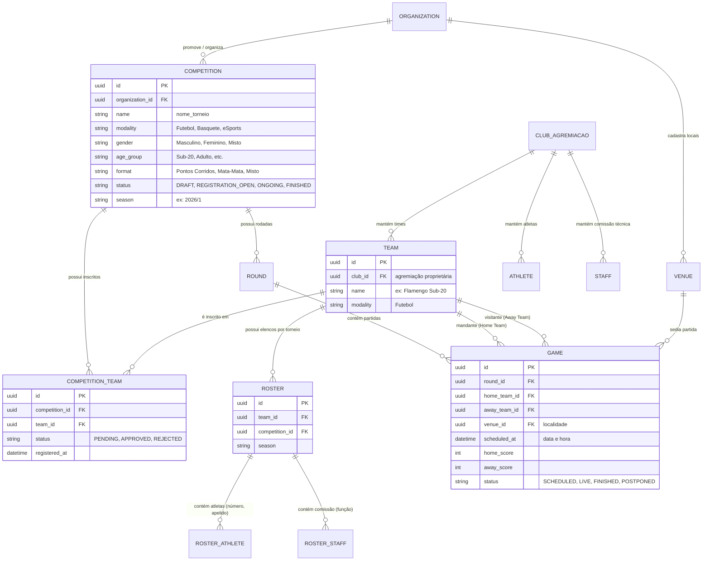
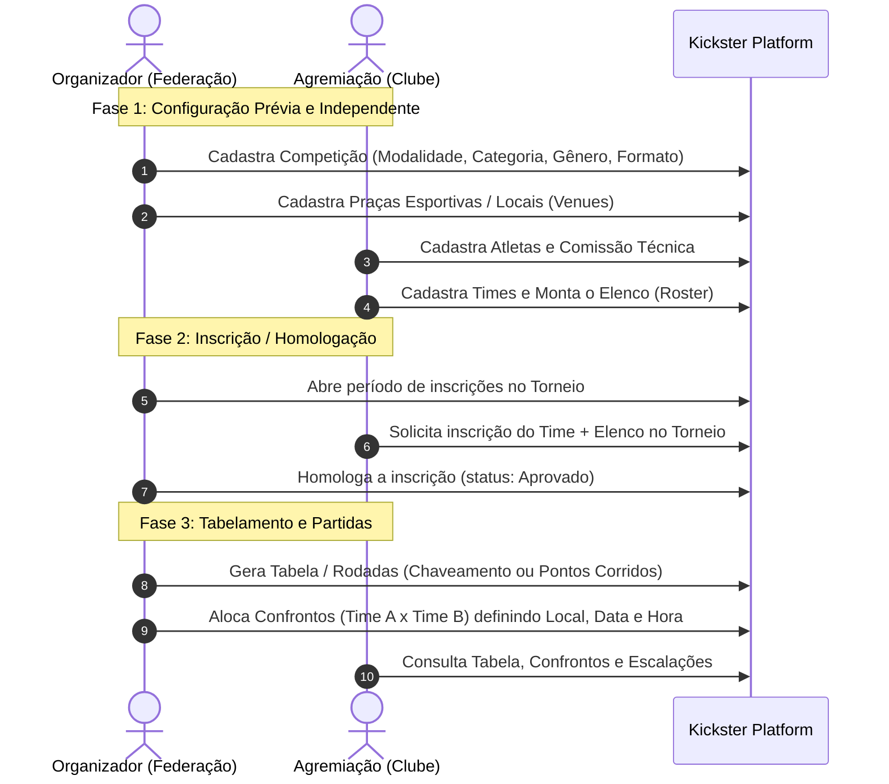

# Arquitetura e Fluxo de Domínio: Módulo de Competições & Torneios

Este documento estabelece o modelo de dados, desacoplamento de entidades e o fluxo operacional de **Competições, Inscrições e Confrontos** no ecossistema Kickster.

---

## 1. Visão Geral do Domínio

O sistema opera de forma desacoplada entre os dois atores principais:

1. **Organização Promotora (Entidade Organizadora / Federação / Liga):**
   - Cria e administra a **Competição / Torneio** (definindo modalidade, gênero, faixa etária, formato de disputa e temporada).
   - Gerencia locais/praças esportivas (**Venues**).
   - Homologa inscrições de equipes.
   - Gera rodadas (**Rounds**) e agenda partidas (**Games/Confrontos**) com data, hora e local.

2. **Agremiação (Clube / Associação Esportiva):**
   - Mantém seu cadastro institucional e base de **Atletas** e **Comissão Técnica**.
   - Cria seus **Times (Equipes)** vinculados à agremiação.
   - Monta o **Elenco (Roster)** específico para cada temporada/torneio.

3. **Elo de Inscrição (Central de Inscrições / Registration):**
   - O Clube inscreve o seu **Time + Roster** na **Competição**.
   - A Promotora avalia/homologa o time na competição (atribuindo chave/conferência/divisão se houver).

---

## 2. Diagrama de Relacionamento de Entidades (ER)

---

## 3. Fluxo Operacional de Negócio (Desacoplado)

---

## 4. Proposta de Telas e Navegação no Painel Admin Kickster

### A. Módulo Competições (Visão Organizador)
- **Menu Lateral:** `Competições`
- **Lista de Competições:**
  - Cards com filtros rápidos por status (*Inscrições Abertas*, *Em Andamento*, *Finalizado*), Modalidade e Temporada.
  - Badges visuais Kickster: Gênero, Faixa Etária, Formato.
  - Ações: Editar, Configurar Rodadas, Ver Inscritos, Encerrar.
- **Formulário de Cadastro/Edição de Competição:**
  - Seção 1: **Identificação:** Nome do Torneio, Temporada, Edição.
  - Seção 2: **Classificação Esportiva:** Modalidade (Dropdown), Gênero (Chips/Dropdown), Faixa Etária (Dropdown).
  - Seção 3: **Regulamento e Formato:** Formato de Disputa (Pontos Corridos, Mata-Mata, Fase de Grupos + Eliminatória), Quantidade de Classificados.
  - Seção 4: **Configuração de Inscrição:** Período de inscrições, limite de equipes, taxa (opcional).

### B. Módulo Gestão de Jogos & Tabela (Visão Organizador)
- **Tela de Chaveamento / Tabela de Jogos:**
  - Seletor de Rodada (*Rodada 1, Quartas, Semifinal, etc.*).
  - Cards de Confronto Kickster: `[Time Mandante]` vs `[Time Visitante]`.
  - Seletor de **Local (Venue)**, **Data** e **Horário**.
  - Registro de Placar / Súmula.

### C. Módulo Agremiações & Times (Visão Clube)
- **Menu Lateral:** `Minha Agremiação` -> `Times & Elencos`.
- Criação de Time e vinculação dos Atletas/Comissão ao torneio vigente.
- Tela **"Inscrições em Torneios"**: lista de competições abertas disponíveis para submeter a equipe.

---

> [!NOTE]
> As tabelas correspondentes no banco de dados (`platform.competitions`, `platform.team`, `platform.roster`, `platform.competition_team`, `platform.rounds`, `platform.games`, `platform.venues`) já existem em `ddl_data_base_main_v1.sql`. O modelo acima espelha e respeita fielmente essa estrutura existente.
