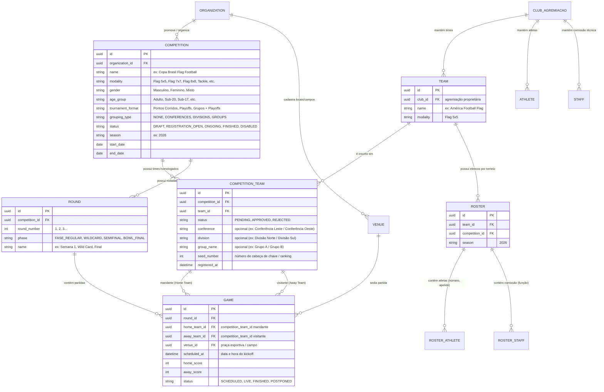
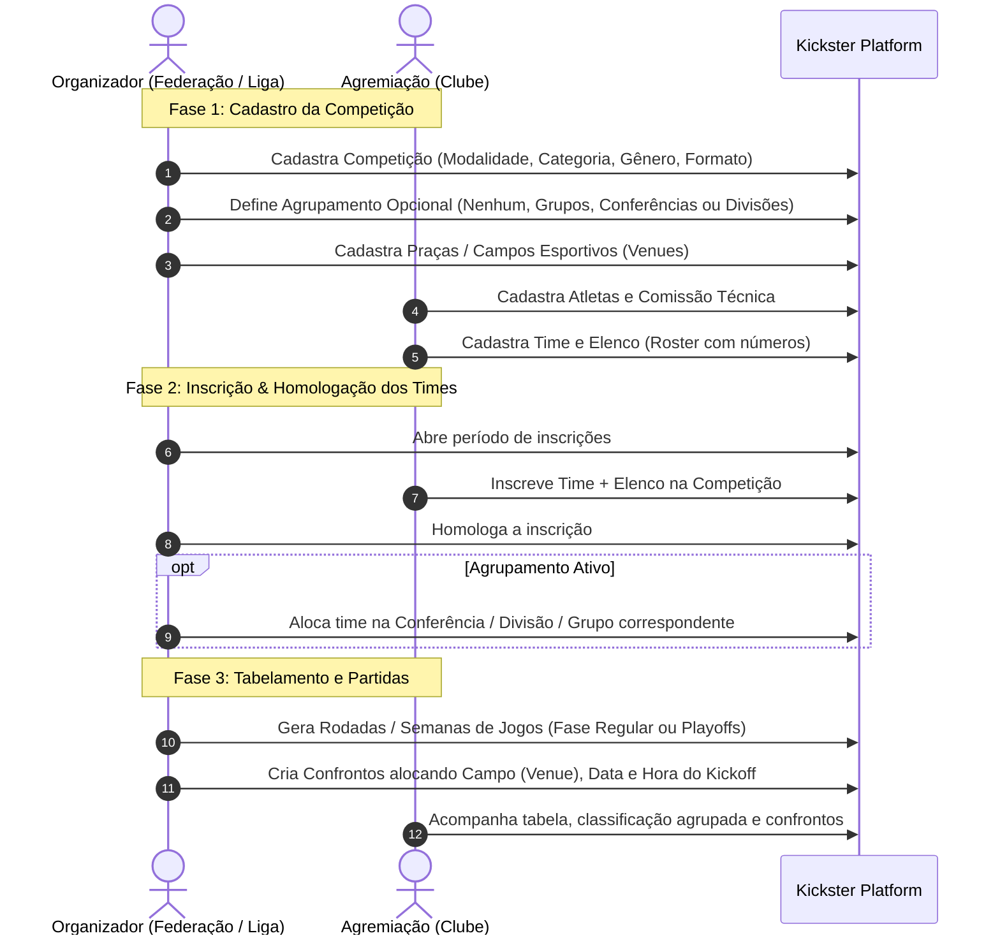

# Arquitetura e Fluxo de Domínio: Módulo de Competições & Torneios (Kickster Platform)

Este documento estabelece o modelo de dados, desacoplamento de entidades e o fluxo operacional de **Competições, Inscrições, Agrupamentos (Conferências / Divisões / Grupos) e Confrontos** no ecossistema Kickster.

---

## 1. Visão Geral do Domínio

O sistema opera de forma desacoplada entre os atores principais:

1. **Organização Promotora (Federação / Liga Esportiva):**
   - Cria e administra a **Competição / Campeonato** (definindo modalidade de Futebol Americano, gênero, faixa etária, formato de disputa e temporada).
   - Define se a competição adota **Agrupamento Opcional** de times (`none`, `conferences`, `divisions`, `groups`).
   - Gerencia praças esportivas / campos de jogo (**Venues**).
   - Homologa inscrições de times e aloca as equipes nas respectivas **Conferências, Divisões ou Grupos** (opcionais).
   - Monta rodadas (**Rounds**) e agenda partidas (**Games / Confrontos**) com data, hora e campo.

2. **Agremiação (Clube / Associação Esportiva):**
   - Mantém seu cadastro institucional e base de **Atletas** e **Comissão Técnica**.
   - Cria seus **Times (Equipes)** vinculados à agremiação.
   - Monta o **Elenco (Roster)** específico com numerações e posições para cada temporada/torneio.

3. **Elo de Inscrição & Agrupamento (Competition Team):**
   - O Clube inscreve o seu **Time + Roster** na **Competição**.
   - A Promotora avalia/homologa o time na competição e **opcionalmente atribui o time a uma Conferência, Divisão ou Grupo** para fins de classificação, chaveamento e tabelamento de confrontos.

---

## 2. Diagrama de Relacionamento de Entidades (ER)

---

## 3. Conceito e Uso dos Agrupamentos Opcionais

No futebol americano (Flag e Tackle), o agrupamento não é uma entidade separada com tabelas complexas de banco, mas sim **aspectos e atributos da competição e do time inscrito**, permitindo modularidade e flexibilidade:

| Nível de Agrupamento | Quando Utilizar | Exemplo Prático | Atributo em `COMPETITION_TEAM` |
| :--- | :--- | :--- | :--- |
| **Nenhum (Tabela Única)** | Torneios tiro-curto em pontos corridos ou eliminatória direta. | Copa Regional Tiro Curto (8 times em pontos corridos) | `conference = null`, `division = null`, `group_name = null` |
| **Grupos (Groups)** | Competições com fase de grupos seguida de playoffs. | Grupo A, Grupo B, Grupo C | `group_name: "Grupo A"` |
| **Conferências (Conferences)** | Ligas divididas geograficamente ou por chave regional. | Conferência Leste e Conferência Oeste | `conference: "Leste"` |
| **Conferências + Divisões** | Ligas maiores estruturadas no formato clássico de Futebol Americano. | Conferência Leste (Divisão Norte / Divisão Sul) | `conference: "Leste"`, `division: "Norte"` |

### Vantagens dessa Modelagem:
1. **Sem tabelas intermediárias desnecessárias:** elimina a complexidade de manter CRUDs de conferências/divisões como entidades isoladas.
2. **Cálculo de Classificação Simplificado:** as tabelas de classificação (standings) filtram diretamente `WHERE competition_id = :id AND conference = :conf AND division = :div`.
3. **Flexibilidade Total:** a promotora pode renomear ou reorganizar os times em divisões sem quebrar chaves estrangeiras rígidas.

---

## 4. Fluxo Operacional de Negócio

---

## 5. Implementação no Frontend (`flag_admin_web`)

1. **Configuração na Competição (`CompetitionCreateScreen` / `CompetitionEditScreen`):**
   - Campo seletor de tipo de agrupamento da competição:
     - `Sem Agrupamento (Tabela Única)`
     - `Grupos (Grupo A, Grupo B...)`
     - `Conferências (Leste, Oeste...)`
     - `Conferências e Divisões`
2. **Tela de Homologação de Times Inscritos (`CompetitionTeamsScreen`):**
   - Lista de times inscritos com ação de homologação.
   - Atribuição direta dos campos opcionais de agrupamento: *Conferência*, *Divisão* e/ou *Grupo*.
3. **Tabela de Classificação (`CompetitionStandingsWidget`):**
   - Filtros ou abas automáticas por Conferência / Divisão / Grupo de acordo com o que foi configurado.
