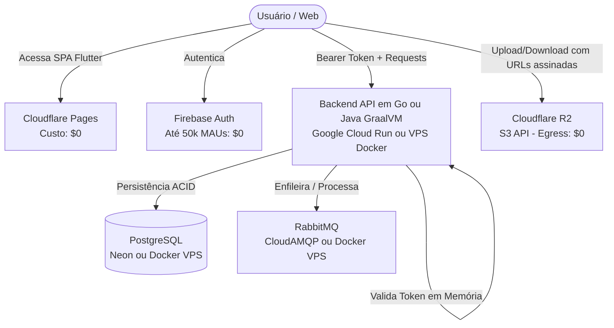

# Análise de Custo-Benefício de Infraestrutura e Serviços em Nuvem

**Data:** 18 de Setembro de 2026 (Atualizado em 20 de Setembro de 2026)  
**Status:** Análise Concluída / Revisada  
**Contexto:** Definição da melhor relação custo-benefício para a stack composta por:
- **Frontend:** Flutter Web (aplicações administrativas e públicas)
- **Backend:** Autenticação, Autorização e APIs de Domínio
- **Persistência:** Banco de dados relacional
- **Mensageria:** RabbitMQ / Assincronismo
- **Storage:** Armazenamento de arquivos / objetos
- **Avaliação adicional:** Serviços do ecossistema Firebase

---

## 1. O Ponto Crítico da Análise: Alocação de Recursos

O maior direcionador de custo em nuvem moderna para esta stack é a **memória RAM** e o **tráfego de saída (egress)**:
- **Java / Spring Boot Tradicional (JVM):** Exige tipicamente entre 512 MB e 1 GB+ de RAM por serviço para manter a JVM estável em produção, encarecendo planos ou estourando limites de free tiers.
- **Java / Spring Boot 3 com GraalVM Native Image:** Compilação AOT (Ahead-of-Time) que derruba o consumo de RAM para **~40 MB a 80 MB** e o cold start para **< 100 ms**, viabilizando Serverless e planos gratuitos mínimos sem estouro de memória (*OOM*).
- **Go (Golang):** Consumo nativo de RAM entre ~20 MB e 60 MB por serviço e compila para binários minúsculos (~15 MB a 30 MB) com tempo de boot de milissegundos.
- **Mensageria (RabbitMQ):** Baseada em Erlang/OTP, consome no mínimo 512 MB a 1 GB estável.
- **Storage:** O custo do tráfego de saída (egress) pode superar com facilidade o custo do armazenamento em repouso.

---

## 2. Comparativo de Provedores e Modelos de Hospedagem

### Opção A: Multi-Cloud Especializada (Gerenciamento Zero & Menor Custo Inicial)
Combinação dos serviços com os *free tiers* mais generosos e padrões abertos (sem vendor lock-in agressivo):

| Camada | Serviço Indicado | Modelo de Custo | Motivo Técnico |
| :--- | :--- | :--- | :--- |
| **Frontend** | **Cloudflare Pages** | **$0,00** | CDN global, tráfego e requisições ilimitados. |
| **Storage** | **Cloudflare R2** | **$0,00** (até 10 GB) + ~$0,015/GB | **Zero taxa de egress/tráfego**. 100% compatível com a API S3. |
| **Backend** | **Google Cloud Run** | **$0,00 a ~$5,00** | Containers sob demanda (*scale-to-zero*). 2M requisições/mês gratuitas. Perfeito para Go ou Java GraalVM. |
| **Auth** | **Firebase Auth** *(ou tokens JWT)* | **$0,00** (até 50k MAUs) | Suporte completo a logins sociais e e-mail/senha. Tokens validados em memória pelo backend. |
| **Mensageria** | **CloudAMQP** | **$0,00** (até 1M msgs/mês) a ~$19 | Evita gerenciar quorum e backups do RabbitMQ. |
| **Banco Relacional** | **Neon.tech** ou **Supabase** | **$0,00** a ~$15 | PostgreSQL gerenciado com auto-scaling e tier inicial gratuito com conexões externas abertas. |
| **Total Estimado** | — | **$0 a $25 / mês** | O menor custo inicial possível mantendo produção gerenciada. |

---

### Opção B: Self-Hosted All-in-One via VPS (Previsibilidade Total e Custo Fixo)
Para evitar contas distribuídas e eliminar qualquer risco de fatura surpresa por requisições:

- **Provedor:** **Hetzner Cloud** (ou **DigitalOcean / Linode / OVHcloud**).
- **Orquestrador:** **Coolify** (PaaS open-source instalada na VPS).
- **Arquitetura:**
  - Frontend e Storage mantidos na Cloudflare (Pages + R2 a custo zero) para aliviar a banda da VPS.
  - Backend, Auth, RabbitMQ e PostgreSQL rodando em containers Docker gerenciados via Coolify.
- **Hardware Necessário:**
  - *Com Backend em Go ou Java GraalVM:* 1 VPS de 2 vCPU e 4 GB de RAM (ex: Hetzner CX22/CAX11) → **~€ 4 a € 7 / mês**.
  - *Com Backend em Java/Spring JVM Tradicional:* 1 VPS de 4 vCPU e 8 GB de RAM (ex: Hetzner CPX31) → **~€ 12 a € 16 / mês**.
- **Total Estimado:** **~$7 a $18 / mês** (fatura fixa e previsível).

---

### Opção C: Hyperscalers Tradicionais e Plataformas PaaS/Serverless Gratuitas

1. **Google Cloud Run (Serverless Container):**
   - **Melhor escolha para Docker com GraalVM ou Go.**
   - *Free Tier permanente:* 2 milhões de requisições gratuitas/mês, 360.000 GB-segundos de memória.
   - Conexão de rede de saída totalmente liberada (permite conectar sem bloqueios a bancos externos como Neon ou Supabase).
   - Cold start praticamente imperceptível (< 100ms com GraalVM Native Image).

2. **Oracle Cloud Infrastructure (OCI - Always Free):**
   - Oferece *Always Free Tier* com até 4 OCPUs ARM e **24 GB de RAM**, além de 200 GB de disco.
   - Excelente para quem quer uma VPS completa sem custo vitalício para rodar Docker Compose (Spring tradicional, Postgres e RabbitMQ juntos sem sufoco de RAM).
   - Exige configuração manual de Linux, portas e firewall.

3. **Panorama Prático de PaaS Gratuitas (Prós e Contras Reais):**
   - **Northflank:** Plano Developer Free com 2 serviços, 512 MB de RAM, 0.5 vCPU, conexões de rede externas liberadas e ativação imediata (sem fila).
   - **Zeabur:** Cota gratuita mensal renovável, deploy ágil via Git/Dockerfile e conexões externas abertas.
   - **Render:** Oferece 512 MB de RAM no plano free, mas **possui limitações severas de conexões externas/portas**, hibernação agressiva após 15 min e banco PostgreSQL gratuito expira em 90 dias.
   - **Koyeb:** Oferece instâncias de 512 MB, porém impõe **fila de espera/aprovação manual** para ativação de instâncias.

4. **AWS / GCP Tradicional (IaaS corporativa padrão):**
   - **Opção mais cara para a stack inicial.**
   - ECS Fargate + RDS PostgreSQL + Amazon MQ for RabbitMQ + S3 dificilmente saem por menos de **$70 a $130 / mês** devido aos custos de instâncias gerenciadas mínimas e taxas de transferência.

---

## 3. Impacto das Linguagens de Backend no Custo

| Linguagem / Runtime | Consumo Médio de RAM | Cold Start | Ajuste de Custo na Infra |
| :--- | :--- | :--- | :--- |
| **Go (Golang)** | **15 MB – 60 MB** | 50 – 150 ms | **Máxima economia.** Viabiliza Serverless (Cloud Run) sem custo ocioso ou VPS minúscula de $5/mês. |
| **Java 21+ (Spring Boot 3 + GraalVM Native)** | **40 MB – 80 MB** | **< 100 ms** | **Equiparável a Go.** Elimina o gargalo de RAM da JVM, permitindo rodar em Serverless gratuito (Cloud Run) ou planos PaaS de 512 MB com folga. |
| **TypeScript (Node/Bun)** | 60 MB – 150 MB | 200 – 400 ms | Custo equilibrado com entrega rápida e compartilhamento de ecossistema. |
| **C# (.NET 8+ Native AOT)** | 80 MB – 180 MB | < 100 ms | Boa alternativa enterprise para quem busca tipagem forte sem a sobrecarga de memória. |
| **Java (Spring Boot tradicional na JVM)** | 512 MB – 1 GB+ | 3s – 10s+ | Encarece a infraestrutura em 2x a 3x por exigir memória dedicada contínua e sofrer com cold start em PaaS que hibernam. |

---

## 4. Avaliação Isenta do Ecossistema Firebase

| Serviço Firebase | Recomendação | Análise de Custo e Viabilidade |
| :--- | :--- | :--- |
| **Firebase Auth** | **Recomendado** | **Reduz custos.** Gratuito até 50.000 MAUs para logins por e-mail/senha e OAuth social (Google, Apple). O backend valida os JWTs em memória sem overhead de rede. *(Evitar login por SMS pelo alto custo por envio)*. |
| **Firebase Cloud Messaging (FCM)** | **Recomendado** | **Custo zero.** Padrão oficial e ilimitado para envio de notificações push móveis/web. |
| **Firebase Storage** | **Não recomendado** | **Aumenta custos.** Embora armazene barato, cobra cerca de **$0,12 por GB de saída (egress)**. O **Cloudflare R2** é superior por ter egress gratuito ($0,00). |
| **Firestore / Realtime DB** | **Não recomendado** | **Aumenta custos para este cenário.** Cobra por operação de leitura/escrita. Queries complexas, filtros e agregações encarecem rapidamente se comparados ao custo estável de um PostgreSQL. |

---

## 5. Arquitetura Alvo Recomendada (Visão Consolidada)

### Síntese Final
1. **Frontend:** Flutter Web hospedado estático no **Cloudflare Pages** ($0).
2. **Autenticação:** **Firebase Auth** (simplifica SDKs e reduz código) ou tokens próprios no backend.
3. **Backend:** **Go** ou **Java 21+ com Spring Boot 3 + GraalVM Native Image** (ambos com consumo ~40-80 MB e cold start < 100 ms, viabilizando Google Cloud Run gratuito ou PaaS/VPS de baixo custo).
4. **Storage:** **Cloudflare R2** (elimina surpresas com tráfego de saída).
5. **Mensageria e Banco:** **RabbitMQ + PostgreSQL** (hospedados no CloudAMQP + Neon para gerência zero, ou unificados em VPS Hetzner com Coolify para custo fixo mínimo).
