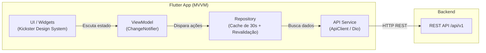

# Flag Platform — Mapa de Componentes

> Catálogo detalhado dos componentes do ecossistema, organizado por camadas e responsabilidades.

---

## 1. Estrutura do Ecossistema Multi-Repositório

O projeto é estruturado em repositórios independentes no GitHub:

```
cesargranelli/
├── flag_backend/         → API Spring Boot (Modular Monolith) — Core transacional e regras de negócio
├── flag_admin_web/       → Interface web Flutter para gestão administrativa e organizadores
├── flag_referee_app/     → App Flutter para arbitragem e mesa (check-in e operação ao vivo de jogos)
├── flag_public_app/      → App Flutter para torcedores, atletas e comunidade (resultados e tabelas)
├── flag_tester_e2e/      → Suite de testes end-to-end com Playwright
├── flag_platform_infra/  → Infraestrutura Docker Compose, Terraform e automações operacionais
└── flag_platform_docs/   → HUB CENTRAL de documentação, ADRs, arquitetura e design tokens
```

---

## 2. Aplicações e Serviços da Plataforma

| Aplicação | Stack Tecnológica | Responsabilidade | Público-alvo | Autenticação |
|:---:|:---:|---|---|---|
| **Flag Backend** | Java 25, Spring Boot 4.1, PostgreSQL 16 | API REST `/api/v1`, validações de negócio e persistência ACID | Todos os clientes | Firebase ID Tokens (stateless) |
| **Flag Admin Web** | Flutter Web, MVVM, Kickster DS | Gestão de organizações, agremiações, inscrições e campeonatos | Staff e diretores | Firebase Auth (Custom Claims) |
| **Flag Referee App** | Flutter Mobile/Tablet, MVVM, Kickster DS | Operação de partidas, check-in, faltas, pontuação e súmula | Árbitros e mesa | Firebase Auth (Claims de Árbitro) |
| **Flag Public App** | Flutter Mobile/Web, MVVM, Kickster DS | Acompanhamento ao vivo, tabelas de classificação e estatísticas | Torcedores e atletas | Aberto / Firebase Auth opcional |
| **Flag Tester E2E** | TypeScript, Playwright | Validação ponta a ponta em ambientes de staging efêmero | Equipe de QA / CI | Tokens de serviço |
| **Flag Platform Infra** | Docker Compose, Terraform, RabbitMQ, Cloudflare | Provisionamento de serviços locais e infraestrutura de nuvem | DevOps / Sysadmin | Chaves de ambiente / Secrets |

---

## 3. Backend Transacional (`flag_backend`)

Construído sob o padrão **Modular Monolith** utilizando **Spring Modulith**, onde cada domínio é isolado em um módulo Java independente.

### Camadas Técnicas Internas:

```
br.com.flagplatform.{modulo}/
├── {Modulo}.java          → Marcador @ApplicationModule do Spring Modulith
├── {Modulo}Lookup.java    → Interface pública exposta para outros módulos
├── controller/            → Endpoints REST sob /api/v1/{recurso}
├── service/               → Regras de negócio e orquestração de transações
├── repository/            → Acesso a dados via jOOQ e Spring Data
├── entity/                → Mapeamento de persistência PostgreSQL
└── dto/                   → Contratos de Request e Response (isolamento da API)
```

### Módulos de Domínio Ativos:
- **`user` & `auth`:** Gerenciamento de perfis de usuário, validação de Firebase Claims e provisionamento.
- **`organization`:** Federações e ligas organizadoras.
- **`institution`:** Agremiações, clubes, associações esportivas e universidades.
- **`affiliation`:** Filiações institucionais entre Agremiações e Organizações, com janelas de filiação.
- **`team`:** Equipes esportivas vinculadas a uma agremiação.
- **`person`:** Pessoas físicas com CPF unificado (atletas, técnicos, árbitros e delegados).
- **`roster`:** Elencos vinculados por competição e temporada (`team_roster`).
- **`competition`:** Campeonatos, temporadas, fases, grupos e conferências.
- **`category`:** Categorias de disputa (modalidade, gênero e faixa etária).
- **`modality`:** Catálogo oficial de modalidades (Flag 5x5, 7x7, 8x8, 9x9 e Full Pads 11x11).
- **`game`:** Partidas agendadas, confrontos, participantes (`game_participants`) e check-in.
- **`play`:** Lances, descidas e eventos de pontuação (`plays`, `score_events`).
- **`standing`:** Projeções de classificação e pontuação acumulada.

---

## 4. Persistência e Estratégia de Dados Híbrida (ADR-002)

1. **PostgreSQL 16 (Escrita / Fonte da Verdade):**
   - Transações ACID garantidas.
   - Migrações versionadas em Java (`db.migration`) via Flyway e tipadas via jOOQ ([ADR-012](../adr/ADR-012-migrations-jooq-java.md)).
   - UUID gerado nativamente em todas as chaves primárias.
2. **Google Cloud Firestore (Leitura / Espelho CQRS Light):**
   - Coleções desnormalizadas para consultas de alta frequência e baixa latência.
   - Suporte nativo a *Realtime Listeners* para atualização em tempo real de placares e classificações no `flag_public_app`.
   - Sincronização orientada a eventos a partir das transações confirmadas no PostgreSQL.

---

## 5. Padrão Arquitetural de Frontend (ADR-011)

Todas as aplicações Flutter (`flag_admin_web`, `flag_referee_app`, `flag_public_app`) compartilham o mesmo padrão arquitetural **MVVM**:



- **Separação Rígida Create vs Edit (ADR Decidido):** Telas de cadastro (`*_create_screen.dart`) e de edição (`*_edit_screen.dart`) são arquivos e rotas completamente segregados.
- **Design System Kickster:** Uso padronizado de componentes oficiais (`KicksterButton`, `KicksterDropdown`, `KicksterCard`, `KicksterMenuAnchor`, `KicksterCalendar`).
