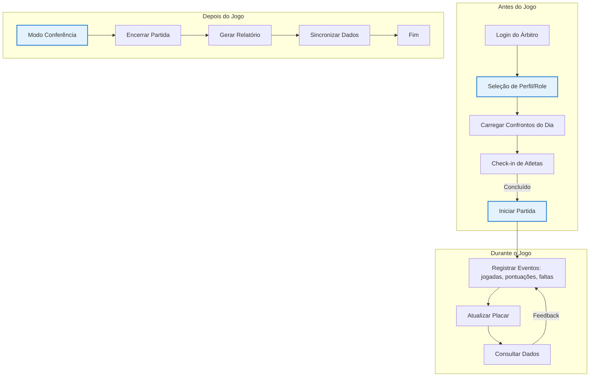

# Características do flag_referee_app

## Contexto

Com a quase conclusão do `flag_admin_web`, a evolução do `flag_referee_app` tornou-se a próxima prioridade para garantir consistência de design, arquitetura e experiência em todo o ecossistema Flag Platform. O aplicativo foi redesenhado para operar eficientemente em dias de jogos, seguindo as melhores práticas de arquitetura Flutter e os padrões estabelecidos pelo Kickster Design System.

---

## Pontos Críticos para Resolução

### 1. Cadastro de Usuário e Definição de Perfil/Role

**Problema:** O sistema possui cadastro de usuário, mas não define qual perfil/role o usuário possui no momento do cadastro. Isso gera ambiguidade na autorização de ações dentro do `flag_referee_app`.

**Solução Proposta:**
- Integrar com a mesma estratégia de `Firebase Auth + Custom Claims` do `flag_admin_web` (ADR-010)
- Durante o onboarding no Referee App, solicitar a seleção de perfil: `REFEREE`, `MANAGER` ou `ADMIN_LIGA`
- Persistir o role como `Custom Claim` no Firebase, assim como feito no backend
- No checklist de migração do fluxo de onboarding, adicionar: "Definir role do usuário no cadastro inicial"

> **Referência:** ADR-010 — Autenticação Firebase-First com Custom Claims; Padrão 1:1 View-ViewModel (ADR-011) para telas de onboarding.

---

## 2. Finalidade do flag_referee_app

O aplicativo serve como a ferramenta principal da mesa operadora em dias de jogos, com as seguintes funcionalidades obrigatórias:

1. **Conferir dados dos confrontos** — Visualizar informações da partida, times, categorias e rodadas antes e durante o jogo
2. **Realizar a abertura da partida para conferências iniciais** — Validar elencos, check-ins preliminares e condições de início
3. **Realizar o check-in dos atletas antes das partidas** — Registrar presença dos atletas, validar elegibilidade e capturar dados adicionais (peso, número da camisa, etc)
4. **Corrigir possíveis erros** — Corrigir informações imprecisas de atletas e participantes em tempo real
5. **Pesquisar informações dos participantes e atletas** — Buscar dados rápidos de atletas, times ou competições durante o jogo
6. **Colocar partidas em andamento** — Iniciar cronômetro, atualizar status da partida de "agendado" para "em andamento"
7. **Registrar eventos durante os jogos** — Jogadas, avanços, pontuações, faltas, penalidades, timeouts e qualquer ocorrência do jogo
8. **Colocar aplicativo em conferência para concluir a partida** — Modo de revisão final antes de encerrar, onde comitê ou autoridades podem validar tudo
9. **Encerramento das partidas** — Finalizar partida, calcular resultados definitivos e gerar relatórios
10. **Offline-first e outros padrões** — Suporte total para operação sem conexão, com sincronização automática quando a conexão for restaurada

> **Padrões de Arquitetura:** Todos os fluxos seguem os [padrões de design de aplicativo Flutter](https://docs.flutter.dev/app-architecture/design-patterns), com ênfase em:
> - **Offline-first**: Dados locais persistentes (Secure Storage / SQLite) que sincronizam com o backend quando online
> - **1:1 View-ViewModel**: Cada tela tem seu ViewModel isolado (ADR-011)
> - **Unidirectional Data Flow**: Dados: Data → VM → View; Eventos: View → VM → Data
> - **State management with ChangeNotifier + Command pattern**: Para operações assíncronas (load, check-in, finalização)
> - **Dependency Injection**: Service → Repository → ViewModel (cadena definida em ADR-011)
> - **Error handling explícito**: Commands track running/error/completed state

> **Integração com flag_admin_web:** O flag_referee_app agora usa os mesmos tokens Firebase Custom Claims, mesma paleta de cores Kickster, mesma tipografia Plus Jakarta Sans e mesmos componentes de UI (`KicksterCard`, `KicksterInput`, `KicksterButton`, etc.) garantindo consistência visual e de experiência.

---

## 3. Fluxo de Operação em Dia de Jogo

---

## 4. Melhorias Aplicadas do flag_admin_web

As seguintes melhorias do `flag_admin_web` foram transferidas ou adaptadas para o `flag_referee_app`:

| Melhoria | flag_admin_web | flag_referee_app |
|----------|----------------|------------------|
| **Autenticação** | Firebase Auth + Custom Claims | Igual — role do árbitro definido no cadastro |
| **Design System** | Kickster UI Kit | Igual — mesmos componentes e tokens |
| **Tipografia** | Plus Jakarta Sans | Igual |
| **Padrão MVVM** | Adotado (ADR-011) | Igual — todas as telas usam ViewModel |
| **Dependency Injection** | Service → Repository → ViewModel | Igual |
| **Componentes Kickster** | Inputs, Buttons, Cards, Chips | Igual — reuse de widgets |
| **Layout Responsivo** | Breakpoints 960px | Adaptado para mobile/tablet Árbitro |
| **Acessibilidade** | Contraste ≥ 4.5:1 | Igual — relevante para árbitros em campo |
| **Offline-first** | Synchronização via Cloud Functions | Igual — crítico para arbitragem em campo |

---

## 4. Próximos Passos

- [ ] **Resolver ponto 1**: Implementar definição de perfil/role no cadastro de usuário do Referee App
- [ ] **Migratar todos os screens** para o padrão MVVM (ADR-011) — screens restantes em legado
- [ ] **Implementar offline-first** completa: persistência local + sincronização Cloud Functions
- [ ] **Criar tela de modo conferência** (item 8) com validação de checklist antes de encerrar
- [ ] **Adicionar componentes Kickster** personalizados para Referee (chips de status, badges de evento, etc)
- [ ] **Integrar Custom Claims** no fluxo de login do Referee App
- [ ] **Testar sync offline → online** em cenários reais de conexão intermitente

---

## 5. Referências

- [ADR-010](adr/ADR-010-autenticacao-firebase-custom-claims.md) — Autenticação Firebase-First
- [ADR-011](adr/ADR-011-flutter-mvvm-architecture.md) — Arquitetura MVVM Flutter
- [Padrões de design Flutter](https://docs.flutter.dev/app-architecture/design-patterns)
- [Kickster Design System](design/kickster-reference.md)
- [Tokens de Design](design/tokens.md)
- [Layout Admin Web](layout-spec.md)
- [Fluxo de telas — Referee App](apps/referee-app/fluxo-de-telas.md)