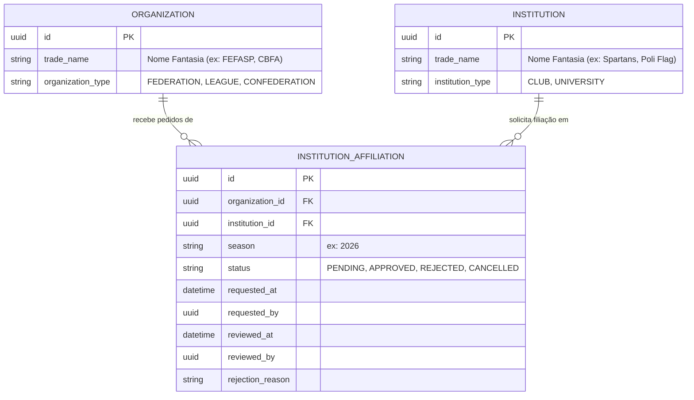

# Arquitetura e Workflow: Filiação de Agremiações (Clubes / Universidades) a Organizações

Este documento detalha as regras de negócio, modelagem e telas para a **Inscrição e Filiação de Agremiações a Organizações Promotoras (Ligas, Federações e Confederações)** por temporada.

---

## 1. Visão Geral do Domínio

A relação entre **Organização** (entidade reguladora) e **Agremiação** (entidade esportiva) baseia-se em governança e ciclos esportivos (temporadas):

1. **Abertura de Temporada de Filiação (Organização):**
   - A Organização estabelece ou abre o ciclo de filiação da temporada (ex: `season = "2026"`, `status = OPEN`).
   - Define requisitos (documentação cadastral, anuidade/taxa de filiação).

2. **Solicitação de Filiação (Agremiação / Clube):**
   - No painel da Agremiação, a diretoria visualiza as Organizações disponíveis com inscrições abertas.
   - O Clube submete o pedido de filiação para a temporada desejada. O status inicial fica `PENDING`.

3. **Homologação / Aceite (Organização):**
   - A Organização possui uma fila/painel de solicitações recebidas.
   - Ações do Organizador:
     - **Aprovar (Aceitar)**: O status passa para `APPROVED`. O clube passa a figurar oficialmente no rol de **Agremiações Filiadas** daquela temporada e fica habilitado a inscrever equipes nas competições promovidas pela entidade.
     - **Recusar (Rejeitar)**: O status passa para `REJECTED`, com preenchimento obrigatório de justificativa (ex: estatuto desatualizado, pendência financeira).

---

## 2. Modelagem de Dados (`platform.institution_affiliations`)

### Índices e Constraints:
- `uk_affiliation_inst_org_season`: `UNIQUE (institution_id, organization_id, season)` — Garante que não haja duplicidade de pedidos para a mesma temporada.

### 2.2 Tabela `platform.affiliation_windows` (Janelas / Períodos de Filiação)
| Coluna | Tipo | Restrições | Descrição |
|---|---|---|---|
| `id` | `UUID` | `PK, DEFAULT gen_random_uuid()` | Identificador único da janela de inscrição |
| `organization_id` | `UUID` | `NOT NULL, FK -> organizations(id)` | Organização promotora |
| `season` | `VARCHAR(10)` | `NOT NULL` | Temporada de vigência (ex: "2026") |
| `title` | `VARCHAR(150)` | `NOT NULL` | Título legível do período |
| `start_date` | `DATE` | `NOT NULL` | Data de abertura das inscrições |
| `end_date` | `DATE` | `NOT NULL` | Data limite de inscrições |
| `status` | `VARCHAR(20)` | `NOT NULL, DEFAULT 'OPEN'` | Status da janela (`OPEN`, `CLOSED`) |
| `instructions` | `TEXT` | `NULL` | Orientações gerais, taxas e documentos exigidos |
| `created_by_email` | `VARCHAR(255)`| `NULL` | Responsável que abriu o período |
| `created_at` | `TIMESTAMPTZ` | `NOT NULL, DEFAULT now()` | Data de criação |
| `updated_at` | `TIMESTAMPTZ` | `NOT NULL, DEFAULT now()` | Data da última alteração |

---

## 3. Endpoints REST (Backend)

| Método | Endpoint | Papel / Permissão | Descrição |
|---|---|---|---|
| `POST` | `/api/v1/organizations/{organizationId}/affiliation-windows` | ADMIN ou ORGANIZER | Abre ou atualiza o período de filiações para uma temporada |
| `POST` | `/api/v1/organizations/{organizationId}/affiliation-windows/{season}/close` | ADMIN ou ORGANIZER | Encerra manualmente o período de inscrições de uma temporada |
| `GET` | `/api/v1/organizations/{organizationId}/affiliation-windows` | Acesso autenticado | Lista as janelas de filiação da organização |
| `GET` | `/api/v1/affiliation-windows/open` | Acesso autenticado | Lista todas as organizações com janelas de filiação abertas no momento |
| `POST` | `/api/v1/institutions/{institutionId}/affiliations` | ADMIN ou REPRESENTATIVE | Clube solicita filiação a uma Organização (bloqueado se a janela estiver fechada ou fora do prazo) |
| `GET` | `/api/v1/institutions/{institutionId}/affiliations` | Acesso autenticado | Lista as filiações históricas e vigentes da Agremiação |
| `GET` | `/api/v1/organizations/{organizationId}/affiliations` | ADMIN ou ORGANIZER | Lista os pedidos de filiação recebidos pela Organização (filtros por temporada e status) |
| `POST` | `/api/v1/organizations/{organizationId}/affiliations/{affiliationId}/approve` | ADMIN ou ORGANIZER | Aprova a filiação do clube para a temporada |
| `POST` | `/api/v1/organizations/{organizationId}/affiliations/{affiliationId}/reject` | ADMIN ou ORGANIZER | Rejeita o pedido informando `reason` |

---

## 4. Telas no Painel Admin Kickster (`flag_admin_web`)

### 4.1 Na Agremiação (`InstitutionDetailScreen`):
- **Seção "Filiações a Ligas e Federações"**:
  - Botão **"Solicitar Filiação"** (consome `/api/v1/affiliation-windows/open` — exibe somente organizações com inscrições abertas e preenche a temporada automaticamente).
  - Cards com badges de status:
    - `Aprovado (Ativo)` em verde com ano da temporada.
    - `Pendente de Aprovação` em amarelo/laranja.
    - `Recusado` em vermelho com tooltip ou diálogo exibindo o motivo da recusa.

### 4.2 Na Organização (`OrganizationDetailScreen`):
- **Cockpit de Filiações**:
  - Seletor de Temporada ativa.
  - Indicador de Período de Inscrições: Status (`OPEN`/`CLOSED`), prazo de término e botão para **"Abrir Período"** ou **"Encerrar Inscrições"**.
  - Mini-inbox de **Triagem Rápida** de Solicitações Pendentes (Aprovar / Recusar com modal de justificativa).
  - Botão de acesso direto: **"Consultar Todas as Agremiações Filiadas"** navegando para a tela dedicada.

### 4.3 Tela Dedicada de Consulta de Afiliados (`OrganizationAffiliatesScreen`):
- Rota: `/organizations/:id/affiliates`
- Cards métricos de topo: total de filiados aprovados, solicitações pendentes e taxa de aprovação.
- Barra de busca e filtros padrão Kickster:
  - `KicksterSearchField` à esquerda.
  - `KicksterDropdown` de status: Todos, Filiados Ativos, Pendentes, Recusados.
  - Seletor de temporada.
- Listagem em cards fluidos com dados da agremiação (nome, tipo, cidade/UF, data de solicitação e status).
- Menu de ações Kickster (`KicksterMenuAnchor`): "Ver Detalhes da Agremiação", "Aprovar", "Recusar".

---

## 5. Separação de Domínios e Perfis

> **Rastreabilidade:** conteúdo absorvido de **ADR-009 — Organização e Agremiação: separação de domínios e perfis**
> (linhagem `main`). O arquivo standalone `adr/ADR-009-organizacao-e-agremiacao.md` foi removido na
> reconciliação de linhagens.

### 5.1. Domínios

| Módulo | Entidades | Tabela(s) | Notas |
|---|---|---|---|
| **Organização** | Federação, Associação, Liga | `organizations` (com `type` enum) | Entidades de governança; **não** contém clubes/universidades. |
| **Agremiação (Institution)** | Club, University | `institutions` | Novo módulo; `Institution` é a entidade e `Club`/`University` são tipos (`institution_type`). Relação com times/atletas via `institution_id`. |

> **Nomenclatura:** **Institution** (entidade) evita a colisão `Club` (entidade) vs `Club` (tipo).
> A filiação a organizações é registrada em `institution_affiliations` por temporada (ver §2),
> refinando a proposta original de junção N:N — a afiliação é **opcional, fraca e mutável**
> (uma agremiação pode estar vinculada a mais de uma organização).

### 5.2. Perfis e permissões (escrita)

| Perfil | `organizations` (fed/assoc/liga) | `institutions` (Club/University) |
|---|---|---|
| **ORGANIZER** | cria/edita | cria/edita |
| **MANAGER** | somente leitura | cria/edita |

- Leitura: ambos os perfis leem os dois módulos.
- `PENDING` continua **read-only global** (ver [ADR-010](../adr/ADR-010-autenticacao-firebase-custom-claims.md) §6.5).
- `SecurityExpressions`: `ORGANIZATION_WRITE = "hasAuthority('STATUS_ACTIVE') and hasAnyRole('ORGANIZER','ADMIN','ADMIN_LIGA')"` e
  `INSTITUTION_WRITE = "hasAuthority('STATUS_ACTIVE') and hasAnyRole('ORGANIZER','MANAGER','ADMIN','ADMIN_LIGA')"`.

### 5.3. Home — novo card "Agremiações"

- Novo `KicksterCard` "Agremiações" no `flag_admin_web`, apontando para o módulo `institutions`.
- **Ordem dos cards:** `Organizações` (1º) → `Agremiações` (2º) → demais cards (Competições, Times, etc.).

### 5.4. Melhorias de UX (backlog anotado, sem implementação)

- **Dropdown — lista descola ao rolar:** o overlay deve ser ancorado ao campo (`OverlayEntry`/`CompositedTransformFollower`)
  e reposicionar/fechar ao scroll ou resize. Registrar como bug de `KicksterDropdown` em `flag_core`.
- **Modal de escolha de cores — fora do Design System:** substituir as 4 cores fixas por paleta editável
  (até 6 cores), com preview ao vivo; persistir `institution.colors: string[]` (hex). Tokens de modal:
  `radius.modal = 24`, `elevation.modal`, `modal.padding = 24`, `modal.gap = 20`, `modal.maxWidth = 343` (mobile) / `480` (web).

