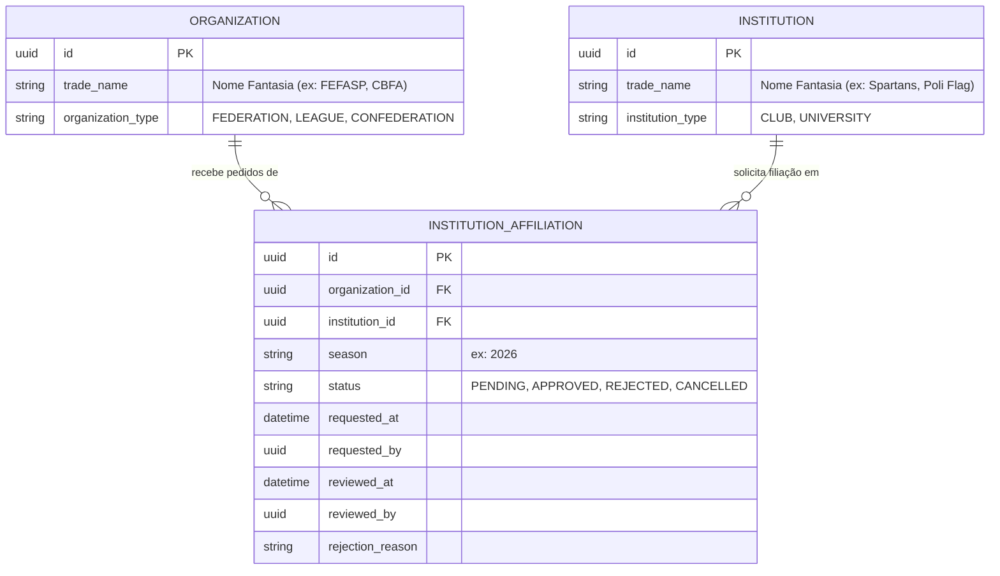

# Arquitetura e Workflow: Filiação de Agremiações (Clubes / Universidades) a Organizações

Este documento detalha as regras de negócio, modelagem e telas para a **Inscrição e Filiação de Agremiações a Organizações Promotoras (Ligas, Federações e Confederações)** por temporada.

---

## 1. Visão Geral do Domínio

A relação entre **Organização** (entidade reguladora) e **Agremiação** (entidade esportiva) baseia-se em governança e ciclos esportivos (temporadas):

1. **Abertura de Temporada de Filiação (Organização):**
   - A Organização estabelece ou abre o ciclo de filiação da temporada (ex: `season = "2026"`, `status = OPEN`).
   - Define requisitos (documentação cadastral, anuidade/taxa de filiação).

2. **Solicitação de Filiação (Agremiação / Clube):**
   - No painel da Agremiação, a diretoria visualiza as Organizações disponíveis com inscrições abertas.
   - O Clube submete o pedido de filiação para a temporada desejada. O status inicial fica `PENDING`.

3. **Homologação / Aceite (Organização):**
   - A Organização possui uma fila/painel de solicitações recebidas.
   - Ações do Organizador:
     - **Aprovar (Aceitar)**: O status passa para `APPROVED`. O clube passa a figurar oficialmente no rol de **Agremiações Filiadas** daquela temporada e fica habilitado a inscrever equipes nas competições promovidas pela entidade.
     - **Recusar (Rejeitar)**: O status passa para `REJECTED`, com preenchimento obrigatório de justificativa (ex: estatuto desatualizado, pendência financeira).

---

## 2. Modelagem de Dados (`platform.institution_affiliations`)

### Índices e Constraints:
- `uk_affiliation_inst_org_season`: `UNIQUE (institution_id, organization_id, season)` — Garante que não haja duplicidade de pedidos para a mesma temporada.

---

## 3. Endpoints REST (Backend)

| Método | Endpoint | Papel / Permissão | Descrição |
|---|---|---|---|
| `POST` | `/api/v1/institutions/{institutionId}/affiliations` | ADMIN ou REPRESENTATIVE | Clube solicita filiação a uma Organização para determinada temporada |
| `GET` | `/api/v1/institutions/{institutionId}/affiliations` | Acesso autenticado | Lista as filiações históricas e vigentes da Agremiação |
| `GET` | `/api/v1/organizations/{organizationId}/affiliations` | ADMIN ou ORGANIZER | Lista os pedidos de filiação recebidos pela Organização (filtros por temporada e status) |
| `POST` | `/api/v1/organizations/{organizationId}/affiliations/{affiliationId}/approve` | ADMIN ou ORGANIZER | Aprova a filiação do clube para a temporada |
| `POST` | `/api/v1/organizations/{organizationId}/affiliations/{affiliationId}/reject` | ADMIN ou ORGANIZER | Rejeita o pedido informando `reason` |

---

## 4. Telas no Painel Admin Kickster (`flag_admin_web`)

### 4.1 Na Agremiação (`InstitutionDetailScreen`):
- **Seção "Filiações a Ligas e Federações"**:
  - Botão **"Solicitar Filiação"** (abre modal com seleção de Organização e Temporada).
  - Cards com badges de status:
    - `Aprovado (Ativo)` em verde com ano da temporada.
    - `Pendente de Aprovação` em amarelo/laranja.
    - `Recusado` em vermelho com tooltip ou diálogo exibindo o motivo da recusa.

### 4.2 Na Organização (`OrganizationDetailScreen`):
- **Aba ou Seção "Agremiações Filiadas & Pedidos de Filiação"**:
  - **Filtro de Temporada** (ex: `2026`).
  - **Contador / Badge de Pendências** (ex.: "3 solicitações aguardando").
  - Tabela/Cards com ações rápidas Kickster:
    - **Aprovar** (com confirmação rápida).
    - **Recusar** (diálogo solicitando motivo).
  - Listagem dos clubes já aprovados com dados de contato e link para ver o perfil do clube.
