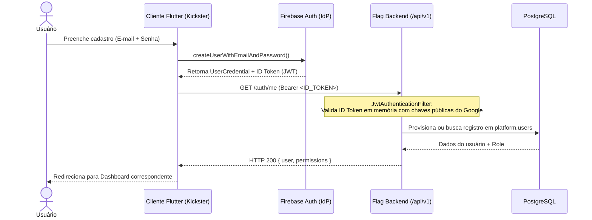
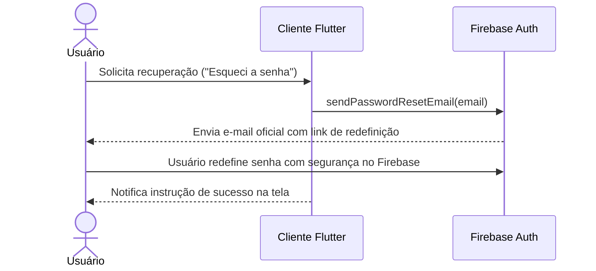
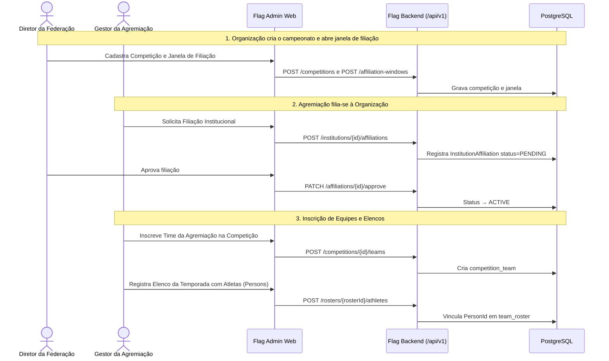
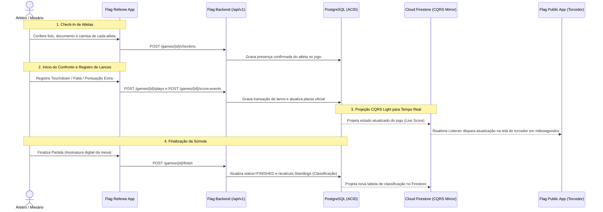

# Flag Platform — Fluxos Lógicos da Solução

> Fluxos operacionais ponta a ponta do ecossistema, desde o ciclo de identidade até a operação de partida e projeção em tempo real.

---

## 1. Ciclo de Vida de Identidade & Autenticação (Firebase-First — ADR-010)

O sistema utiliza o **Firebase Auth** como Provedor de Identidade (IdP) e o backend como validador *stateless* com base em **Custom Claims**.

### Cadastro e Primeiro Acesso:

### Recuperação de Senha:

---

## 2. Fluxo Institucional: Organização, Agremiação e Filiação

A Flag Platform separa estritamente quem organiza campeonatos (`Organization`) de quem possui as equipes esportivas (`Institution`):

---

## 3. Fluxo de Operação de Partida ao Vivo (Mesa → Público — ADR-002)

O `flag_referee_app` opera o confronto de forma tolerante a oscilações de rede. O resultado é consolidado no PostgreSQL e espelhado no Firestore para os torcedores:

---

## 4. Matriz de Autorização por Endpoint (SpEL & SecurityExpressions)

A segurança da API é garantida stateless em tempo de execução via `@PreAuthorize`:

| Recurso | Ação | Mínimo Papel Exigido | Método / Endpoint |
|---|---|:---:|---|
| **Organizações** | Criar nova Organização | `SUPER_ADMIN` | `POST /api/v1/organizations` |
| **Agremiações** | Criar Agremiação | `ORG_ADMIN` / `SUPER_ADMIN` | `POST /api/v1/institutions` |
| **Filiações** | Aprovar Filiação de Agremiação | `ORG_ADMIN` da Organização | `PATCH /api/v1/affiliations/{id}/approve` |
| **Competições** | Criar Campeonato e Categorias | `ORG_ADMIN` da Organização | `POST /api/v1/competitions` |
| **Elencos** | Inscrever Atletas no Elenco | `MANAGER` / `ORG_ADMIN` | `POST /api/v1/rosters/{id}/athletes` |
| **Partidas** | Realizar Check-in de Atleta | `REFEREE` / `MANAGER` / `ORG_ADMIN` | `POST /api/v1/games/{id}/checkins` |
| **Súmula** | Registrar Pontuação de Lance | `REFEREE` da Partida | `POST /api/v1/games/{id}/score-events` |
| **Público** | Consultar Classificação e Jogos | *Acesso Público (Sem Auth)* | `GET /api/v1/competitions/{id}/standings` |
