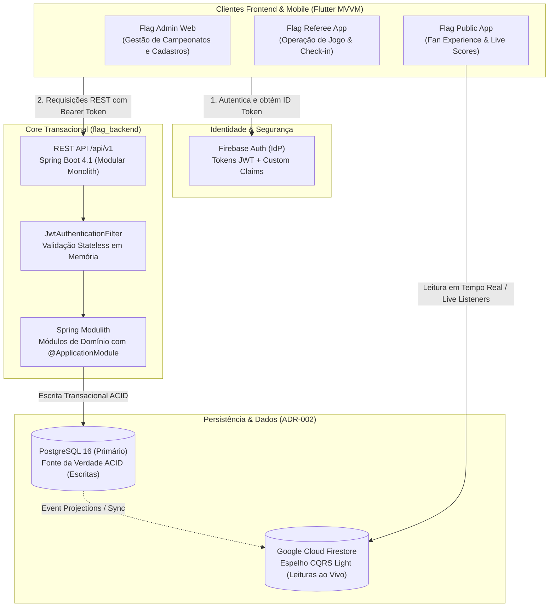

# Flag Platform — Visão Geral da Solução

> **Documentação de Arquitetura da Solução Global**  
> Baseada no ecossistema de repositórios independentes (`flag_backend`, `flag_admin_web`, `flag_referee_app`, `flag_public_app`, `flag_platform_infra`, `flag_tester_e2e`) e no catálogo oficial de ADRs.

---

## 1. O que é a Flag Platform

A **Flag Platform** é a plataforma integrada de gestão, arbitragem e experiência do torcedor para o ecossistema de **Flag Football** e futebol americano no Brasil. 

O sistema é composto por um backend em **Modular Monolith** (Spring Boot) que atende de forma unificada e performática a três clientes especializados:

| Aplicação | Plataforma | Usuário Principal | Autenticação | Papel no Ecossistema |
|:---:|:---:|:---:|:---:|---|
| **Flag Admin Web** | Flutter Web | Diretores de Federações, Ligas e Agremiações | Firebase Auth (Stateless) | Gestão institucional, cadastros de agremiações, equipes, campeonatos e auditoria. |
| **Flag Referee App** | Flutter Mobile / Tablet | Árbitros e Mesários | Firebase Auth (Offline-tolerant) | Operação de partida em campo: check-in de atletas, cronômetro, faltas e pontuação lance a lance. |
| **Flag Public App** | Flutter Mobile / Web | Atletas, Treinadores, Torcedores e Fãs | Opcional / Aberto | Acompanhamento ao vivo, tabelas de classificação, estatísticas de jogadores e notícias. |

---

## 2. Hierarquia de Entidades de Domínio

O domínio esportivo elimina sobreposição de conceitos e garante integridade referencial rígida:

```
Organization (Federação / Liga Esportiva)
    └── Competition (Campeonato / Torneio)
          └── Category (Modalidade + Gênero + Faixa Etária)
                └── Round / Group (Fase de Grupos / Playoffs)
                      └── Game (Partida Oficial)
                            ├── GameParticipant (Árbitros / Delegados na mesa)
                            ├── CheckIn (Validação presencial de atletas)
                            ├── Play & ScoreEvent (Lances e Pontuações)
                            └── Standing (Classificação atualizada via projeção)

Institution (Agremiação / Clube / Associação Esportiva / Universidade)
    ├── InstitutionAffiliation (Filiação formal com uma Organization)
    └── Team (Equipe Esportiva representativa)
          └── TeamRoster (Elenco vinculado por Temporada / Competição)
                └── Person (Pessoa física unificada com CPF único e histórico de atleta)
```

### Regras Fundamentais do Domínio:
1. **Organization ≠ Institution:** A Organização gere torneios e federações; a Instituição (Agremiação) possui as equipes e os atletas.
2. **Filiação:** A Instituição filia-se a uma ou mais Organizações através de `InstitutionAffiliation`.
3. **Equipes e Elencos:** Uma Equipe pertence à Instituição e inscreve um `TeamRoster` específico para cada competição/temporada.
4. **Pessoa Física Unificada (`Person`):** Atletas, treinadores, árbitros e delegados são instâncias de `Person` com CPF único no sistema, evitando cadastros duplicados e preservando o histórico esportivo vitalício.

---

## 3. Arquitetura Técnica em Camadas

A Flag Platform adota uma estratégia híbrida: **PostgreSQL para transações ACID** e **Firestore como espelho CQRS Light** para leituras massivas em tempo real no app público.



---

## 4. Matriz de Decisões de Arquitetura Vigentes (ADRs)

| ADR | Título | Decisão Vigente |
|:---:|--------|-----------------|
| **ADR-001** | [Nova Filosofia de Arquitetura](../adr/ADR-001-nova-filosofia-arquitetura.md) | Simplificação: 5 níveis hierárquicos, 4 roles, Firebase-First, Modular Monolith e CQRS Light. |
| **ADR-002** | [Estratégia de Dados Híbrida](../adr/ADR-002-postgres-firestore-cqs.md) | Oracle ADB como fonte da verdade (ACID/Escritas) e Firestore como espelho para leituras ao vivo. |
| **ADR-003** | [Diagramas de Base de Dados](../adr/ADR-003-diagramas-base-de-dados.md) | Schema relacional detalhado: Organizations, Institutions, Teams, Persons e Jogos. |
| **ADR-004** | [Diagramas do Projeto](../adr/ADR-004-diagramas-projeto.md) | Fluxos de domínio, sequência de autenticação Firebase-First e ciclo de vida do jogo. |
| **ADR-005** | [Staging Efêmero E2E](../adr/ADR-005-staging-efemero-e2e.md) | Ambientes temporários e isolados para execução de testes ponta a ponta com Playwright. |
| **ADR-006** | [Team / Roster / Season Refactor](../adr/ADR-006-team-roster-season-refactor.md) | Desacoplamento estrutural: time fixo, elencos por temporada e histórico do atleta. |
| **ADR-010** | [Autenticação Centralizada Firebase-First](../adr/ADR-010-autenticacao-firebase-custom-claims.md) | Firebase Auth em todos os clientes, validação stateless via Custom Claims no backend. |
| **ADR-011** | [Padrão Arquitetural Flutter MVVM](../adr/ADR-011-flutter-mvvm-architecture.md) | Arquitetura oficial das UIs: Domain, Services, Repositories com cache 30s e ViewModels ChangeNotifier. |
| **ADR-012** | [Migrations com Liquibase (YAML) + Oracle ADB](../adr/ADR-012-migrations-jooq-java.md) | Migrações versionadas via changelogs Liquibase (YAML); DDL em código proibido. |
| **ADR-013** | [Gitflow para Gestão de Documentação](../adr/ADR-013-gitflow-documentacao.md) | Governança documental com branches de feature, develop e tags de versão. |
| **ADR-014** | [Atualização de Diretivas em ADRs](../adr/ADR-014-atualizacao-diretivas.md) | Princípio de documentos vivos: atualizar ADRs preservando histórico original. |
| **ADR-015** | [Importação em Rascunho de Organizações](../adr/ADR-015-importacao-rascunho-organizacoes.md) | Criação de organizações como `INACTIVE` via `importDraft`. |
| **ADR-016** | [Gestão de Segredos via GitHub Environments](../adr/ADR-016-gestao-segredos-github-environments.md) | Segredos em environments do GitHub com rotação controlada. |
| **ADR-017** | [Configuração de Playoffs](../adr/ADR-017-configuracao-playoffs.md) | Modelo de configuração de fases eliminatórias. |
| **ADR-018** | [Espelhamento Firestore (Admin SDK)](../adr/ADR-018-espelhamento-firestore-admin-sdk.md) | Espelhamento Oracle ADB → Firestore pelo backend. |
| **ADR-019** | [Modular Monolith](../adr/ADR-019-modular-monolith.md) | Backend Spring Boot em monolito modular (renumerado do antigo ADR-003 da linhagem `main`). |
| **ADR-020** | [Migração de Autenticação para Firebase Auth](../adr/ADR-020-firebase-auth-migration.md) | Decisão histórica de migração para Firebase Auth + Custom Claims (renumerado do antigo ADR-004 da linhagem `main`). |

---

## 5. Estrutura do Ecossistema Multi-Repositório

O projeto é dividido em repositórios especializados para garantir independência de ciclo de vida e deploy:

| Repositório | Escopo | Stack Tecnológica |
|---|---|---|
| [`flag_backend`](https://github.com/cesargranelli/flag_backend) | Núcleo de regras de negócio, persistência e API REST | Java 25, Spring Boot, Spring Modulith, Oracle ADB, Liquibase (YAML), OCI/Docker/Caddy |
| [`flag_admin_web`](https://github.com/cesargranelli/flag_admin_web) | Painel web administrativo | Flutter Web, Dart 3.x, MVVM, Kickster Design System |
| [`flag_referee_app`](https://github.com/cesargranelli/flag_referee_app) | Aplicativo operacional da mesa e árbitros | Flutter Mobile/Tablet, MVVM, Kickster Design System |
| [`flag_public_app`](https://github.com/cesargranelli/flag_public_app) | Aplicativo do torcedor e atleta | Flutter Mobile/Web, MVVM, Kickster Design System |
| [`flag_platform_infra`](https://github.com/cesargranelli/flag_platform_infra) | Orquestração local, IaC e pipelines | Docker Compose, Terraform, PostgreSQL, RabbitMQ, Cloudflare |
| [`flag_tester_e2e`](https://github.com/cesargranelli/flag_tester_e2e) | Bateria de testes funcionais ponta a ponta | TypeScript, Playwright |
| [`flag_platform_docs`](https://github.com/cesargranelli/flag-platform-docs) | **Repositório Central de Documentação Global** | Markdown, Jekyll, GitHub Pages |
