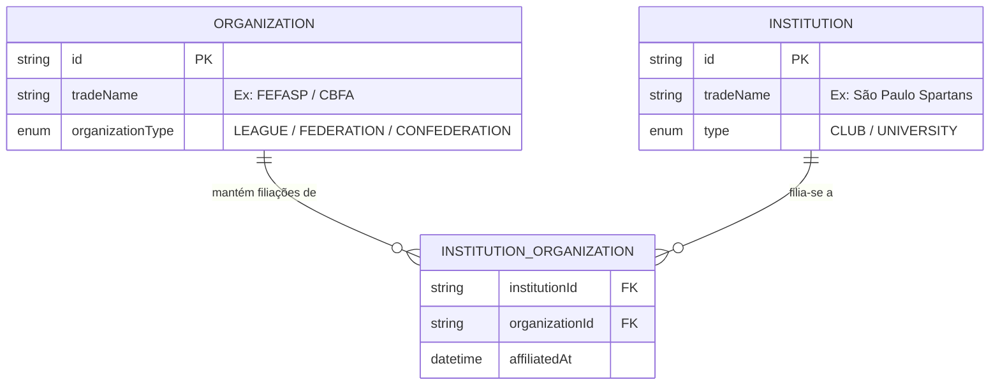

# Modelo Visual: Padronização de Cadastro/Edição e Relação de Filiação

---

## 1. Contexto do Negócio e Relação de Filiação

> [!IMPORTANT]
> **Hierarquia e Papel no Domínio**:
> - **Organização**: É a entidade reguladora / administradora de competições esportivas (ex.: **Ligas**, **Federações estaduais** e **Confederações nacionais** como CBFA, FEFASP, etc.).
> - **Agremiação**: É a entidade esportiva de base (ex.: **Clubes** como Corinthians Steamrollers, São Paulo Spartans ou **Universidades** como Poli Flag).
> - **Relação de Filiação**: **A Agremiação se filia a uma ou mais Organizações**. A Organização **possui Agremiações Filiadas**.

### Ajustes de Nomenclatura e Domínio:
| Local | Como estava | Como deve ficar (Correto) |
|---|---|---|
| **Tela de Cadastro/Edição de Agremiação** | Bloco solto com título genérico | **"Filiação a Organizações"** *"Selecione as ligas, federações ou confederações às quais esta agremiação é filiada"* |
| **Tela de Detalhes da Agremiação** | *"Organizações Filiadas"* (ambíguo) | **"Filiação a Organizações"** (Exibe as organizações às quais o clube é filiado com badges/cards) |
| **Tela de Detalhes da Organização** | Inexistente | Nova Seção: **"Agremiações Filiadas"** (Exibe os clubes e universidades filiados a esta federação/liga, com contagem e links diretos) |

---

## 2. Padronização Visual do Cadastro e Edição de Agremiações

A tela de criação e edição de agremiações ([`InstitutionFormScreen`](file:///C:/Projetos/America/flag_admin_web/lib/ui/institution/widgets/institution_form_screen.dart)) passará a seguir estritamente o mesmo padrão estrutural de [`OrganizationCreateScreen`](file:///C:/Projetos/America/flag_admin_web/lib/ui/organization/widgets/organization_create_screen.dart):

1. **Estrutura por Cards Envolventes (`_section`)**:
   - Cada grupo de campos fica dentro de um `Card` Kickster com borda suave (`AppColors.line`), raio `12`, fundo `AppColors.surface` e padding `16`.
   - Cabeçalho padronizado com `KicksterSectionTitle(title: ..., icon: ...)`.

2. **Seções Padronizadas em Agremiação**:
   - 🏢 **1. Dados Básicos**:
     - *Nome Fantasia* (obrigatório, validação em tempo real).
     - *Razão Social* (opcional/obrigatório se PJ).
     - *Tipo de Agremiação*: [`KicksterDropdown`](file:///C:/Projetos/America/flag_admin_web/lib/src/core/widgets/kickster_dropdown.dart) (Clube ou Universidade) com ícone temático.
     - *Sigla / Abreviação*.
     - *Documento*: Tipo (CNPJ / CPF / Registro Acadêmico) + Número formatado.
   - 👤 **2. Representação & Diretoria**:
     - *Nome do Presidente ou Representante*.
     - *CPF do Presidente*.
   - 📬 **3. Contato & Redes**:
     - *E-mail Oficial*, *Telefone / WhatsApp*, *Site Oficial*, *Instagram (@)*.
   - 📍 **4. Localização**:
     - *País* (Brasil padrão), *Estado (UF)*, *Cidade*.
   - 🎨 **5. Identidade Visual & Cores**:
     - Logo (URL / Upload) com preview Kickster.
     - Paleta de 4 cores da agremiação (Primária, Secundária, Terciária, Quaternária) com seletor interativo e preview do swatch.
   - 🤝 **6. Filiação a Organizações (Ligas e Federações)**:
     - Bloco estilizado em Card próprio.
     - Seleção de organizações ativas disponíveis no sistema via chips ou combobox multi-seleção Kickster com feedback claro de quais ligas/federações a agremiação faz parte.

---

## 3. Adição da Seção "Agremiações Filiadas" no Detalhe da Organização

Na tela [`OrganizationDetailScreen`](file:///C:/Projetos/America/flag_admin_web/lib/ui/organization/widgets/organization_detail_screen.dart), adicionaremos a seção:
- **Título**: *"Agremiações Filiadas"* (`Icons.shield_outlined`).
- **Conteúdo**: Grid ou lista de cartões com os clubes/universidades que possuem filiação ativa a esta Organização, exibindo:
  - Logo e Nome do Clube.
  - Badge do Tipo (`Clube` ou `Universidade`).
  - Sigla e Cidade/UF.
  - Toque para navegar diretamente para a tela de detalhes da agremiação.
- **Empty State**: Caso nenhuma agremiação esteja filiada ainda, mensagem contextual: *"Nenhuma agremiação filiada a esta organização."*.

---

## 4. Diagrama da Relação de Filiação

